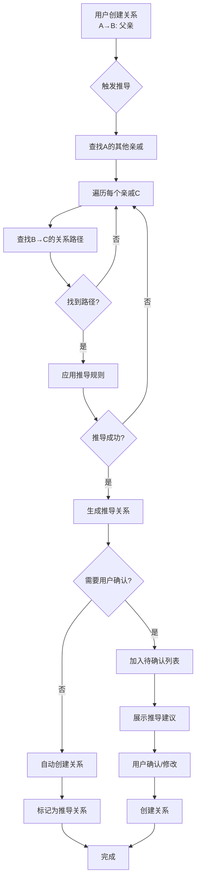
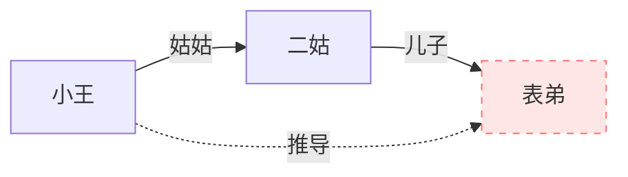

# 关系类型设计 - 亲属关系

## 文档说明

本文档定义了"亲属关系"（family_relative）类型的完整设计，遵循《关系类型设计规范.md》的要求。

**类型ID**：`family_relative`
**分类**：`family`（家庭关系）
**版本**：1.1
**设计日期**：2026-03-22

**类型性质**：
- 系统预装类型（首次安装时自动导入到数据库）
- 与用户自定义类型技术上完全平等
- 存储在 guanxi_types 集合中，可被修改或删除
- 包含完整的关系推导配置

---

## 目录

- [1. 类型概述](#1.-类型概述)
  - [1.1 业务场景](#1.1-业务场景)
  - [1.2 设计目标](#1.2-设计目标)
  - [1.3 关键特点](#1.3-关键特点)
- [2. 完整类型定义](#2.-完整类型定义)
- [3. 字段详细说明](#3.-字段详细说明)
  - [3.1 称谓（title）](#3.1-称谓（title）)
  - [3.2 亲缘类型（lineage）](#3.2-亲缘类型（lineage）)
  - [3.3 亲缘远近（proximity）](#3.3-亲缘远近（proximity）)
  - [3.4 来往频率（contactFrequency）](#3.4-来往频率（contactfrequency）)
  - [3.5 家族支系（branch）](#3.5-家族支系（branch）)
- [4. 配置说明](#4.-配置说明)
  - [4.1 时间段配置](#4.1-时间段配置)
  - [4.2 关系方向配置](#4.2-关系方向配置)
  - [4.3 显示配置](#4.3-显示配置)
  - [4.4 重复控制](#4.4-重复控制)
- [5. 国际化资源](#5.-国际化资源)
  - [5.1 中文资源（zh-CN）](#5.1-中文资源（zh-cn）)
  - [5.2 英文资源（en-US）](#5.2-英文资源（en-us）)
- [6. 实现代码](#6.-实现代码)
  - [6.1 类型类实现](#6.1-类型类实现)
  - [6.2 注册类型](#6.2-注册类型)
  - [6.3 数据库初始化](#6.3-数据库初始化)
- [7. 关系推导系统](#7.-关系推导系统)
  - [7.1 推导系统概述](#7.1-推导系统概述)
  - [7.2 推导规则定义](#7.2-推导规则定义)
  - [7.3 推导算法实现](#7.3-推导算法实现)
  - [7.4 推导流程设计](#7.4-推导流程设计)
  - [7.5 推导关系的标识](#7.5-推导关系的标识)
  - [7.6 用户交互设计](#7.6-用户交互设计)
  - [7.7 推导系统的限制和注意事项](#7.7-推导系统的限制和注意事项)
  - [7.8 推导系统配置](#7.8-推导系统配置)
  - [7.9 实现示例](#7.9-实现示例)
  - [7.10 推导系统的优化建议](#7.10-推导系统的优化建议)
- [8. 使用场景](#8.-使用场景)
  - [8.1 场景1：记录核心家庭成员](#8.1-场景1：记录核心家庭成员)
  - [8.2 场景2：管理庞大的家族关系](#8.2-场景2：管理庞大的家族关系)
  - [8.3 场景3：追踪家族来往情况](#8.3-场景3：追踪家族来往情况)
  - [8.4 场景4：智能关系推导（新增）](#8.4-场景4：智能关系推导（新增）)
  - [8.5 场景5：发现未知的远房亲戚](#8.5-场景5：发现未知的远房亲戚)
- [9. 验证规则](#9.-验证规则)
  - [9.1 必填验证](#9.1-必填验证)
  - [9.2 格式验证](#9.2-格式验证)
  - [9.3 枚举值验证](#9.3-枚举值验证)

---

## 1. 类型概述

### 1.1 业务场景

亲属关系是最传统和最复杂的关系类型之一，涵盖了家族中的各种血缘和姻亲关系。

**典型使用场景**：
- 记录家族成员关系（父母、子女、兄弟姐妹）
- 管理亲戚联系信息（叔伯、姑舅、表亲堂亲等）
- 追溯家族族谱
- 节日聚会人员管理

### 1.2 设计目标

1. **覆盖广泛**：支持直系、旁系、姻亲等多种亲属关系
2. **简单易用**：通过称谓字段快速标识关系
3. **灵活扩展**：支持记录亲缘远近、来往频率等额外信息
4. **持续性**：亲属关系通常是持续的，不需要强制指定时间段

### 1.3 关键特点

- ✓ 不要求必填时间段（亲属关系通常从确立起就持续存在）
- ✓ 双向关系（互为亲戚）
- ✓ 高优先级（优先级：85，在图谱中突出显示）
- ✓ 5个专属字段：称谓、亲缘类型、亲缘远近、来往频率、家族支系

---

## 2. 完整类型定义

```javascript
{
  // ===== 基本信息 =====
  _id: "family_relative",
  name: "亲属关系",
  nameEn: "Relative",
  nameI18nKey: "guanxiType.family_relative.name",

  // ===== 视觉标识 =====
  icon: "users",
  color: "#FF6B6B",

  // ===== 分类 =====
  category: "family",

  // ===== 描述 =====
  description: "家族成员、血缘或姻亲关系，包括直系、旁系、姻亲等",
  descriptionEn: "Family members, blood or marriage relations, including lineal, collateral, and in-law relationships",

  // ===== 字段定义 =====
  fields: [
    {
      name: "title",
      label: "称谓",
      labelEn: "Title",
      labelI18nKey: "guanxiType.family_relative.fields.title.label",
      type: "string",
      required: true,
      placeholder: "如：姑姑、表哥、姨夫",
      placeholderEn: "e.g., Uncle, Cousin, Aunt",
      placeholderI18nKey: "guanxiType.family_relative.fields.title.placeholder",
      validation: {
        max: 20,
        message: "称谓不能超过20个字符",
        messageEn: "Title cannot exceed 20 characters",
        messageI18nKey: "guanxiType.family_relative.fields.title.validation.max"
      }
    },
    {
      name: "lineage",
      label: "亲缘类型",
      labelEn: "Lineage Type",
      labelI18nKey: "guanxiType.family_relative.fields.lineage.label",
      type: "select",
      required: true,
      options: [
        {
          value: "direct",
          label: "直系",
          labelEn: "Direct Lineage",
          labelI18nKey: "guanxiType.family_relative.fields.lineage.options.direct"
        },
        {
          value: "collateral",
          label: "旁系",
          labelEn: "Collateral Lineage",
          labelI18nKey: "guanxiType.family_relative.fields.lineage.options.collateral"
        },
        {
          value: "in_law",
          label: "姻亲",
          labelEn: "In-law",
          labelI18nKey: "guanxiType.family_relative.fields.lineage.options.in_law"
        },
        {
          value: "adoptive",
          label: "义亲",
          labelEn: "Adoptive",
          labelI18nKey: "guanxiType.family_relative.fields.lineage.options.adoptive"
        }
      ],
      defaultValue: "collateral"
    },
    {
      name: "proximity",
      label: "亲缘远近",
      labelEn: "Proximity",
      labelI18nKey: "guanxiType.family_relative.fields.proximity.label",
      type: "select",
      required: false,
      options: [
        {
          value: "immediate",
          label: "至亲",
          labelEn: "Immediate",
          labelI18nKey: "guanxiType.family_relative.fields.proximity.options.immediate"
        },
        {
          value: "close",
          label: "近亲",
          labelEn: "Close",
          labelI18nKey: "guanxiType.family_relative.fields.proximity.options.close"
        },
        {
          value: "distant",
          label: "远亲",
          labelEn: "Distant",
          labelI18nKey: "guanxiType.family_relative.fields.proximity.options.distant"
        }
      ],
      placeholder: "请选择亲缘远近",
      placeholderEn: "Select proximity",
      placeholderI18nKey: "guanxiType.family_relative.fields.proximity.placeholder"
    },
    {
      name: "contactFrequency",
      label: "来往频率",
      labelEn: "Contact Frequency",
      labelI18nKey: "guanxiType.family_relative.fields.contactFrequency.label",
      type: "select",
      required: false,
      options: [
        {
          value: "daily",
          label: "每天",
          labelEn: "Daily",
          labelI18nKey: "guanxiType.family_relative.fields.contactFrequency.options.daily"
        },
        {
          value: "weekly",
          label: "每周",
          labelEn: "Weekly",
          labelI18nKey: "guanxiType.family_relative.fields.contactFrequency.options.weekly"
        },
        {
          value: "monthly",
          label: "每月",
          labelEn: "Monthly",
          labelI18nKey: "guanxiType.family_relative.fields.contactFrequency.options.monthly"
        },
        {
          value: "yearly",
          label: "每年",
          labelEn: "Yearly",
          labelI18nKey: "guanxiType.family_relative.fields.contactFrequency.options.yearly"
        },
        {
          value: "rarely",
          label: "很少联系",
          labelEn: "Rarely",
          labelI18nKey: "guanxiType.family_relative.fields.contactFrequency.options.rarely"
        }
      ],
      placeholder: "选择来往频率",
      placeholderEn: "Select contact frequency",
      placeholderI18nKey: "guanxiType.family_relative.fields.contactFrequency.placeholder"
    },
    {
      name: "branch",
      label: "家族支系",
      labelEn: "Family Branch",
      labelI18nKey: "guanxiType.family_relative.fields.branch.label",
      type: "string",
      required: false,
      placeholder: "如：父系、母系、外公家、大伯家",
      placeholderEn: "e.g., Paternal, Maternal, Uncle's Family",
      placeholderI18nKey: "guanxiType.family_relative.fields.branch.placeholder",
      validation: {
        max: 30,
        message: "家族支系不能超过30个字符",
        messageEn: "Family branch cannot exceed 30 characters",
        messageI18nKey: "guanxiType.family_relative.fields.branch.validation.max"
      }
    }
  ],

  // ===== 配置 =====
  config: {
    supportMultiPeriod: false,      // 亲属关系通常不会中断，不支持多时间段
    requirePeriod: false,            // 不要求必填时间段
    bidirectional: true,             // 双向关系
    showInGraph: true,               // 在图谱中显示
    priority: 85,                    // 高优先级（家庭关系优先显示）
    allowDuplicate: false,           // 不允许同一对人物建立多个亲属关系
    autoReminder: false              // 不自动创建提醒
  },

  // ===== 系统字段 =====
  isBuiltIn: true,
  isEnabled: true,
  createdBy: "system",
  createdAt: new Date("2026-03-22"),
  updatedAt: new Date("2026-03-22")
}
```

---

## 3. 字段详细说明

### 3.1 称谓（title）

**字段名**：`title`
**类型**：`string`
**必填**：是

**说明**：
亲戚之间的称呼，是最核心的识别字段。中国的亲戚称谓体系非常复杂，通过称谓可以清晰表达关系。

**示例值**：
- 直系：爷爷、奶奶、爸爸、妈妈、儿子、女儿
- 旁系：伯伯、叔叔、姑姑、舅舅、姨妈、堂哥、表妹
- 姻亲：姑父、姨夫、嫂子、弟媳、妹夫

**验证规则**：
- 最大长度：20字符
- 不能为空

**UI提示**：
- 中文：如：姑姑、表哥、姨夫
- 英文：e.g., Uncle, Cousin, Aunt

---

### 3.2 亲缘类型（lineage）

**字段名**：`lineage`
**类型**：`select`
**必填**：是

**说明**：
标识亲属关系的类型，用于分类和统计。

**选项定义**：

| 值 | 中文 | 英文 | 说明 |
|----|------|------|------|
| direct | 直系 | Direct Lineage | 祖父母-父母-子女的纵向血缘关系 |
| collateral | 旁系 | Collateral Lineage | 兄弟姐妹及其子女等横向血缘关系 |
| in_law | 姻亲 | In-law | 因婚姻产生的亲属关系 |
| adoptive | 义亲 | Adoptive | 收养、认干亲等法定或社会认定的亲属关系 |

**默认值**：`collateral`（旁系，最常见）

**使用场景**：
- 直系：父子、母女、祖孙关系
- 旁系：堂兄弟、表姐妹、伯叔姑舅姨
- 姻亲：姑父、姨夫、嫂子、妹夫、连襟
- 义亲：干爹、干妈、义兄弟

---

### 3.3 亲缘远近（proximity）

**字段名**：`proximity`
**类型**：`select`
**必填**：否

**说明**：
描述亲缘关系的远近程度，用于关系强度计算和图谱展示。

**选项定义**：

| 值 | 中文 | 英文 | 说明 | 示例 |
|----|------|------|------|------|
| immediate | 至亲 | Immediate | 关系最近的家庭成员 | 父母、配偶、子女 |
| close | 近亲 | Close | 经常来往的近亲 | 兄弟姐妹、祖父母、伯叔姑舅姨 |
| distant | 远亲 | Distant | 较少来往的远房亲戚 | 堂兄弟、表姐妹、远房亲戚 |

**使用建议**：
- 此字段可选，但填写后可以：
  - 在图谱中用不同粗细的线表示亲疏
  - 计算关系强度时给予不同权重
  - 按亲疏远近筛选显示

---

### 3.4 来往频率（contactFrequency）

**字段名**：`contactFrequency`
**类型**：`select`
**必填**：否

**说明**：
记录与该亲戚的实际来往频率，与亲缘远近不同，这是实际交往情况。

**选项定义**：

| 值 | 中文 | 英文 | 说明 |
|----|------|------|------|
| daily | 每天 | Daily | 几乎每天都有联系或见面 |
| weekly | 每周 | Weekly | 每周至少联系一次 |
| monthly | 每月 | Monthly | 每月至少联系一次 |
| yearly | 每年 | Yearly | 通常只在节假日或特殊场合见面 |
| rarely | 很少联系 | Rarely | 很少来往，可能几年才见一次 |

**使用场景**：
- 关系强度计算（高频来往关系强度更高）
- 提醒创建（为重要节日提醒联系）
- 分析统计（了解家族来往模式）

**注意**：
- 来往频率与亲缘远近是两个维度
- 例如：远房表弟（distant）但可能因同城而经常来往（weekly）
- 例如：亲哥哥（immediate）但因异地可能很少见面（yearly）

---

### 3.5 家族支系（branch）

**字段名**：`branch`
**类型**：`string`
**必填**：否

**说明**：
标识亲戚所属的家族支系，用于区分庞大家族中的不同分支。

**示例值**：
- "父系"、"母系"
- "外公家"、"外婆家"
- "大伯家"、"二叔家"、"三姑家"
- "老家支系"、"城里支系"

**使用场景**：
- 庞大家族的分支管理
- 按支系筛选显示
- 家族族谱绘制

**验证规则**：
- 最大长度：30字符
- 可以为空

---

## 4. 配置说明

### 4.1 时间段配置

```javascript
supportMultiPeriod: false,
requirePeriod: false
```

**理由**：
- 亲属关系一旦确立（如出生时的血缘关系），通常是终身存在的
- 不会像朋友、同事关系那样可能中断或重建
- 即使失联多年，亲缘关系本身不会消失
- 因此不支持多时间段，也不要求用户必须填写时间段

**特殊情况**：
- 如果用户希望记录"认识时间"或"来往时间段"，可以在备注中记录
- 义亲关系（认干亲）可能有明确的开始时间，用户可选择填写

---

### 4.2 关系方向配置

```javascript
bidirectional: true
```

**理由**：
- 亲属关系是双向的、对等的
- A是B的姑姑，则B是A的侄子/侄女
- 系统会自动维护双向关系

---

### 4.3 显示配置

```javascript
showInGraph: true,
priority: 85
```

**理由**：
- 家庭关系是人际关系网中最重要的关系类型之一
- 在图谱中应该优先显示，用更粗的线、更醒目的颜色
- 优先级85属于高优先级（仅次于父母子女等核心家庭关系的90+）

---

### 4.4 重复控制

```javascript
allowDuplicate: false
```

**理由**：
- 两个人之间的亲属关系是唯一的
- 不可能既是姑姑又是表姐（这种情况应该记录在称谓或备注中）
- 防止误操作导致数据冗余

---

## 5. 国际化资源

### 5.1 中文资源（zh-CN）

```json
{
  "guanxiType": {
    "family_relative": {
      "name": "亲属关系",
      "description": "家族成员、血缘或姻亲关系，包括直系、旁系、姻亲等",
      "fields": {
        "title": {
          "label": "称谓",
          "placeholder": "如：姑姑、表哥、姨夫",
          "validation": {
            "max": "称谓不能超过20个字符"
          }
        },
        "lineage": {
          "label": "亲缘类型",
          "options": {
            "direct": "直系",
            "collateral": "旁系",
            "in_law": "姻亲",
            "adoptive": "义亲"
          }
        },
        "proximity": {
          "label": "亲缘远近",
          "placeholder": "请选择亲缘远近",
          "options": {
            "immediate": "至亲",
            "close": "近亲",
            "distant": "远亲"
          }
        },
        "contactFrequency": {
          "label": "来往频率",
          "placeholder": "选择来往频率",
          "options": {
            "daily": "每天",
            "weekly": "每周",
            "monthly": "每月",
            "yearly": "每年",
            "rarely": "很少联系"
          }
        },
        "branch": {
          "label": "家族支系",
          "placeholder": "如：父系、母系、外公家、大伯家",
          "validation": {
            "max": "家族支系不能超过30个字符"
          }
        }
      }
    }
  }
}
```

### 5.2 英文资源（en-US）

```json
{
  "guanxiType": {
    "family_relative": {
      "name": "Relative",
      "description": "Family members, blood or marriage relations, including lineal, collateral, and in-law relationships",
      "fields": {
        "title": {
          "label": "Title",
          "placeholder": "e.g., Uncle, Cousin, Aunt",
          "validation": {
            "max": "Title cannot exceed 20 characters"
          }
        },
        "lineage": {
          "label": "Lineage Type",
          "options": {
            "direct": "Direct Lineage",
            "collateral": "Collateral Lineage",
            "in_law": "In-law",
            "adoptive": "Adoptive"
          }
        },
        "proximity": {
          "label": "Proximity",
          "placeholder": "Select proximity",
          "options": {
            "immediate": "Immediate",
            "close": "Close",
            "distant": "Distant"
          }
        },
        "contactFrequency": {
          "label": "Contact Frequency",
          "placeholder": "Select contact frequency",
          "options": {
            "daily": "Daily",
            "weekly": "Weekly",
            "monthly": "Monthly",
            "yearly": "Yearly",
            "rarely": "Rarely"
          }
        },
        "branch": {
          "label": "Family Branch",
          "placeholder": "e.g., Paternal, Maternal, Uncle's Family",
          "validation": {
            "max": "Family branch cannot exceed 30 characters"
          }
        }
      }
    }
  }
}
```

---

## 6. 实现代码

### 6.1 类型类实现

```javascript
// types/family_relative.type.js
const BaseGuanxiType = require('./base.type');

/**
 * 亲属关系类型
 */
class FamilyRelativeType extends BaseGuanxiType {
  constructor() {
    super({
      _id: 'family_relative',
      name: '亲属关系',
      nameEn: 'Relative',
      nameI18nKey: 'guanxiType.family_relative.name',
      icon: 'users',
      color: '#FF6B6B',
      category: 'family',
      description: '家族成员、血缘或姻亲关系，包括直系、旁系、姻亲等',
      descriptionEn: 'Family members, blood or marriage relations, including lineal, collateral, and in-law relationships',

      fields: [
        {
          name: 'title',
          label: '称谓',
          labelEn: 'Title',
          labelI18nKey: 'guanxiType.family_relative.fields.title.label',
          type: 'string',
          required: true,
          placeholder: '如：姑姑、表哥、姨夫',
          placeholderEn: 'e.g., Uncle, Cousin, Aunt',
          placeholderI18nKey: 'guanxiType.family_relative.fields.title.placeholder',
          validation: {
            max: 20,
            message: '称谓不能超过20个字符',
            messageEn: 'Title cannot exceed 20 characters',
            messageI18nKey: 'guanxiType.family_relative.fields.title.validation.max'
          }
        },
        {
          name: 'lineage',
          label: '亲缘类型',
          labelEn: 'Lineage Type',
          labelI18nKey: 'guanxiType.family_relative.fields.lineage.label',
          type: 'select',
          required: true,
          options: [
            {
              value: 'direct',
              label: '直系',
              labelEn: 'Direct Lineage',
              labelI18nKey: 'guanxiType.family_relative.fields.lineage.options.direct'
            },
            {
              value: 'collateral',
              label: '旁系',
              labelEn: 'Collateral Lineage',
              labelI18nKey: 'guanxiType.family_relative.fields.lineage.options.collateral'
            },
            {
              value: 'in_law',
              label: '姻亲',
              labelEn: 'In-law',
              labelI18nKey: 'guanxiType.family_relative.fields.lineage.options.in_law'
            },
            {
              value: 'adoptive',
              label: '义亲',
              labelEn: 'Adoptive',
              labelI18nKey: 'guanxiType.family_relative.fields.lineage.options.adoptive'
            }
          ],
          defaultValue: 'collateral'
        },
        {
          name: 'proximity',
          label: '亲缘远近',
          labelEn: 'Proximity',
          labelI18nKey: 'guanxiType.family_relative.fields.proximity.label',
          type: 'select',
          required: false,
          options: [
            {
              value: 'immediate',
              label: '至亲',
              labelEn: 'Immediate',
              labelI18nKey: 'guanxiType.family_relative.fields.proximity.options.immediate'
            },
            {
              value: 'close',
              label: '近亲',
              labelEn: 'Close',
              labelI18nKey: 'guanxiType.family_relative.fields.proximity.options.close'
            },
            {
              value: 'distant',
              label: '远亲',
              labelEn: 'Distant',
              labelI18nKey: 'guanxiType.family_relative.fields.proximity.options.distant'
            }
          ],
          placeholder: '请选择亲缘远近',
          placeholderEn: 'Select proximity',
          placeholderI18nKey: 'guanxiType.family_relative.fields.proximity.placeholder'
        },
        {
          name: 'contactFrequency',
          label: '来往频率',
          labelEn: 'Contact Frequency',
          labelI18nKey: 'guanxiType.family_relative.fields.contactFrequency.label',
          type: 'select',
          required: false,
          options: [
            {
              value: 'daily',
              label: '每天',
              labelEn: 'Daily',
              labelI18nKey: 'guanxiType.family_relative.fields.contactFrequency.options.daily'
            },
            {
              value: 'weekly',
              label: '每周',
              labelEn: 'Weekly',
              labelI18nKey: 'guanxiType.family_relative.fields.contactFrequency.options.weekly'
            },
            {
              value: 'monthly',
              label: '每月',
              labelEn: 'Monthly',
              labelI18nKey: 'guanxiType.family_relative.fields.contactFrequency.options.monthly'
            },
            {
              value: 'yearly',
              label: '每年',
              labelEn: 'Yearly',
              labelI18nKey: 'guanxiType.family_relative.fields.contactFrequency.options.yearly'
            },
            {
              value: 'rarely',
              label: '很少联系',
              labelEn: 'Rarely',
              labelI18nKey: 'guanxiType.family_relative.fields.contactFrequency.options.rarely'
            }
          ],
          placeholder: '选择来往频率',
          placeholderEn: 'Select contact frequency',
          placeholderI18nKey: 'guanxiType.family_relative.fields.contactFrequency.placeholder'
        },
        {
          name: 'branch',
          label: '家族支系',
          labelEn: 'Family Branch',
          labelI18nKey: 'guanxiType.family_relative.fields.branch.label',
          type: 'string',
          required: false,
          placeholder: '如：父系、母系、外公家、大伯家',
          placeholderEn: 'e.g., Paternal, Maternal, Uncle\'s Family',
          placeholderI18nKey: 'guanxiType.family_relative.fields.branch.placeholder',
          validation: {
            max: 30,
            message: '家族支系不能超过30个字符',
            messageEn: 'Family branch cannot exceed 30 characters',
            messageI18nKey: 'guanxiType.family_relative.fields.branch.validation.max'
          }
        }
      ],

      config: {
        supportMultiPeriod: false,
        requirePeriod: false,
        bidirectional: true,
        showInGraph: true,
        priority: 85,
        allowDuplicate: false,
        autoReminder: false
      }
    });
  }

  /**
   * 计算关系强度
   * 亲属关系的强度由亲缘远近和来往频率共同决定
   */
  calculateStrength(attributes) {
    let strength = 50; // 基础分

    // 根据亲缘远近加分
    const proximityScores = {
      immediate: 40,
      close: 25,
      distant: 10
    };
    if (attributes.proximity) {
      strength += proximityScores[attributes.proximity] || 0;
    }

    // 根据来往频率加分
    const frequencyScores = {
      daily: 30,
      weekly: 20,
      monthly: 10,
      yearly: 5,
      rarely: 0
    };
    if (attributes.contactFrequency) {
      strength += frequencyScores[attributes.contactFrequency] || 0;
    }

    // 直系亲属额外加分
    if (attributes.lineage === 'direct') {
      strength += 20;
    }

    return Math.min(strength, 100); // 最高100分
  }

  /**
   * 生成关系描述文本
   */
  generateDescription(attributes) {
    const parts = [];

    if (attributes.title) {
      parts.push(attributes.title);
    }

    if (attributes.lineage) {
      const lineageLabels = {
        direct: '直系',
        collateral: '旁系',
        in_law: '姻亲',
        adoptive: '义亲'
      };
      parts.push(`(${lineageLabels[attributes.lineage]})`);
    }

    if (attributes.branch) {
      parts.push(`- ${attributes.branch}`);
    }

    return parts.join(' ');
  }

  /**
   * 验证属性值
   */
  validate(attributes) {
    const errors = [];

    // 必填验证
    if (!attributes.title || attributes.title.trim() === '') {
      errors.push({
        field: 'title',
        message: '称谓不能为空'
      });
    }

    if (!attributes.lineage) {
      errors.push({
        field: 'lineage',
        message: '请选择亲缘类型'
      });
    }

    // 长度验证
    if (attributes.title && attributes.title.length > 20) {
      errors.push({
        field: 'title',
        message: '称谓不能超过20个字符'
      });
    }

    if (attributes.branch && attributes.branch.length > 30) {
      errors.push({
        field: 'branch',
        message: '家族支系不能超过30个字符'
      });
    }

    return {
      valid: errors.length === 0,
      errors
    };
  }
}

module.exports = FamilyRelativeType;
```

### 6.2 注册类型

```javascript
// types/registry.js
const FamilyRelativeType = require('./family_relative.type');

// 注册到类型注册表
const typeRegistry = require('./type_registry');
typeRegistry.register(new FamilyRelativeType());
```

### 6.3 数据库初始化

```javascript
// scripts/init_types.js
const FamilyRelativeType = require('../types/family_relative.type');

async function initFamilyRelativeType(db) {
  const type = new FamilyRelativeType();

  await db.collection('guanxi_types').add({
    data: {
      ...type.toJSON(),
      isBuiltIn: true,
      isEnabled: true,
      createdBy: 'system',
      createdAt: db.serverDate(),
      updatedAt: db.serverDate()
    }
  });

  console.log('亲属关系类型初始化完成');
}
```

---

## 7. 关系推导系统

### 7.1 推导系统概述

亲属关系具有传递性和可推导性。基于已建立的基本关系，系统可以自动推导出隐含的亲属关系，大幅减少用户的手动输入工作量。

**核心价值**：
- 🎯 **减少输入**：只需录入核心关系，自动生成衍生关系
- 🔍 **发现隐藏关系**：自动发现间接的亲属关系
- ✅ **保证完整性**：确保亲属关系、甚至是族谱的完整性和一致性
- 🧮 **辅助族谱**：自动构建完整的家族族谱

**适用范围**：
- 仅适用于**亲属关系**类型
- 其他关系类型（好友、同事等）通常不具备推导规则

---

### 7.2 推导规则定义

#### 7.2.1 基础推导规则库

推导规则以**关系链模式**定义：`[关系1] + [关系2] → [推导关系]`

**直系关系推导**：

| 关系链 | 推导结果 | 示例 |
|--------|----------|------|
| 父亲 + 父亲 | 爷爷/祖父 | 我爸的爸爸 = 我爷爷 |
| 父亲 + 母亲 | 奶奶/祖母 | 我爸的妈妈 = 我奶奶 |
| 母亲 + 父亲 | 外公/姥爷 | 我妈的爸爸 = 我外公 |
| 母亲 + 母亲 | 外婆/姥姥 | 我妈的妈妈 = 我外婆 |
| 儿子 + 儿子 | 孙子 | 我儿子的儿子 = 我孙子 |
| 儿子 + 女儿 | 孙女 | 我儿子的女儿 = 我孙女 |

**旁系关系推导**：

| 关系链 | 推导结果 | 示例 |
|--------|----------|------|
| 父亲 + 兄弟 | 伯伯/叔叔 | 我爸的兄弟 = 我伯伯/叔叔 |
| 父亲 + 姐妹 | 姑姑 | 我爸的姐妹 = 我姑姑 |
| 母亲 + 兄弟 | 舅舅 | 我妈的兄弟 = 我舅舅 |
| 母亲 + 姐妹 | 姨妈/姨母 | 我妈的姐妹 = 我姨妈 |
| 兄弟 + 儿子 | 侄子 | 我兄弟的儿子 = 我侄子 |
| 兄弟 + 女儿 | 侄女 | 我兄弟的女儿 = 我侄女 |
| 姐妹 + 儿子 | 外甥 | 我姐妹的儿子 = 我外甥 |
| 姐妹 + 女儿 | 外甥女 | 我姐妹的女儿 = 我外甥女 |

**姻亲关系推导**：

| 关系链 | 推导结果 | 示例 |
|--------|----------|------|
| 配偶 + 父亲 | 岳父/公公 | 我配偶的爸爸 = 我岳父/公公 |
| 配偶 + 母亲 | 岳母/婆婆 | 我配偶的妈妈 = 我岳母/婆婆 |
| 配偶 + 兄弟 | 大舅子/小舅子 | 我配偶的兄弟 = 我舅子 |
| 兄弟 + 配偶 | 嫂子/弟媳 | 我兄弟的配偶 = 我嫂子/弟媳 |
| 姐妹 + 配偶 | 姐夫/妹夫 | 我姐妹的配偶 = 我姐夫/妹夫 |
| 姑姑 + 配偶 | 姑父 | 我姑姑的配偶 = 我姑父 |
| 舅舅 + 配偶 | 舅妈 | 我舅舅的配偶 = 我舅妈 |

**堂表亲推导**：

| 关系链 | 推导结果 | 示例 |
|--------|----------|------|
| 伯叔 + 儿子 | 堂兄/堂弟 | 我叔叔的儿子 = 我堂弟 |
| 伯叔 + 女儿 | 堂姐/堂妹 | 我叔叔的女儿 = 我堂妹 |
| 姑姑 + 儿子 | 表兄/表弟 | 我姑姑的儿子 = 我表弟 |
| 舅舅 + 女儿 | 表姐/表妹 | 我舅舅的女儿 = 我表妹 |
| 姨妈 + 儿子 | 表兄/表弟 | 我姨妈的儿子 = 我表弟 |

---

#### 7.2.2 推导规则数据结构

```javascript
// 推导规则定义
const familyDeductionRules = [
  {
    // 父亲的父亲 = 爷爷
    path: ['父亲', '父亲'],
    result: {
      title: '爷爷',
      lineage: 'direct',
      proximity: 'close',
      generation: 2  // 向上2代
    },
    confidence: 1.0  // 推导置信度（100%确定）
  },
  {
    // 父亲的兄弟 = 伯伯/叔叔
    path: ['父亲', '兄弟'],
    result: {
      title: '伯伯/叔叔',  // 需要用户确认具体称谓
      lineage: 'collateral',
      proximity: 'close',
      generation: 1  // 向上1代
    },
    confidence: 0.95,  // 需要确认伯伯还是叔叔
    needUserConfirm: true
  },
  {
    // 兄弟的儿子 = 侄子
    path: ['兄弟', '儿子'],
    result: {
      title: '侄子',
      lineage: 'collateral',
      proximity: 'close',
      generation: -1  // 向下1代
    },
    confidence: 1.0
  },
  {
    // 配偶的父亲 = 岳父/公公
    path: ['配偶', '父亲'],
    result: {
      title: '岳父/公公',
      lineage: 'in_law',
      proximity: 'immediate',
      generation: 1
    },
    confidence: 0.95,
    needUserConfirm: true  // 需要确认是岳父还是公公
  },
  {
    // 父亲的兄弟的儿子 = 堂兄/堂弟
    path: ['父亲', '兄弟', '儿子'],
    result: {
      title: '堂兄/堂弟',
      lineage: 'collateral',
      proximity: 'close',
      generation: 0  // 同辈
    },
    confidence: 0.9,
    needUserConfirm: true  // 需要确认堂兄还是堂弟
  }
  // ... 更多规则
];
```

---

### 7.3 推导算法实现

#### 7.3.1 核心推导函数

```javascript
/**
 * 亲属关系推导引擎
 */
class FamilyRelationDeductor {
  constructor() {
    this.rules = familyDeductionRules;
  }

  /**
   * 查找两个人物之间的所有关系路径
   * @param {String} fromId - 起点人物ID
   * @param {String} toId - 终点人物ID
   * @param {Number} maxDepth - 最大搜索深度（默认3）
   * @returns {Array} 关系路径数组
   */
  async findRelationPaths(fromId, toId, maxDepth = 3) {
    const paths = [];
    const visited = new Set();

    // BFS搜索所有路径
    const queue = [{
      currentId: fromId,
      path: [],
      depth: 0
    }];

    while (queue.length > 0) {
      const { currentId, path, depth } = queue.shift();

      // 到达目标
      if (currentId === toId && depth > 0) {
        paths.push(path);
        continue;
      }

      // 深度限制
      if (depth >= maxDepth) continue;

      // 查找当前人物的所有直接亲属关系
      const relations = await this.getDirectRelations(currentId);

      for (const relation of relations) {
        const nextId = relation.toCharacterId;
        const pathKey = `${currentId}-${nextId}`;

        if (!visited.has(pathKey)) {
          visited.add(pathKey);
          queue.push({
            currentId: nextId,
            path: [...path, relation],
            depth: depth + 1
          });
        }
      }
    }

    return paths;
  }

  /**
   * 根据关系路径推导关系
   * @param {Array} path - 关系路径（一系列guanxi对象）
   * @returns {Object} 推导出的关系定义
   */
  deduceRelation(path) {
    // 提取路径上的称谓序列
    const titlePath = path.map(r => r.attributes.title);

    // 在规则库中查找匹配的推导规则
    for (const rule of this.rules) {
      if (this.matchPath(titlePath, rule.path)) {
        return {
          ...rule.result,
          source: 'deduced',
          deductionPath: titlePath,
          confidence: rule.confidence,
          needUserConfirm: rule.needUserConfirm || false
        };
      }
    }

    // 未找到精确匹配，尝试通用规则
    return this.applyGenericRules(path);
  }

  /**
   * 匹配路径模式
   * 支持模糊匹配（如：'兄弟'可以匹配'哥哥'、'弟弟'）
   */
  matchPath(actualPath, rulePath) {
    if (actualPath.length !== rulePath.length) return false;

    for (let i = 0; i < actualPath.length; i++) {
      if (!this.matchTitle(actualPath[i], rulePath[i])) {
        return false;
      }
    }
    return true;
  }

  /**
   * 称谓模糊匹配
   */
  matchTitle(actual, pattern) {
    // 精确匹配
    if (actual === pattern) return true;

    // 同义词匹配
    const synonyms = {
      '父亲': ['爸爸', '爹', '父', 'dad', 'father'],
      '母亲': ['妈妈', '娘', '母', 'mom', 'mother'],
      '兄弟': ['哥哥', '弟弟', '兄', '弟', 'brother'],
      '姐妹': ['姐姐', '妹妹', '姐', '妹', 'sister'],
      '配偶': ['妻子', '丈夫', '老婆', '老公', 'spouse', 'wife', 'husband'],
      '儿子': ['子', 'son'],
      '女儿': ['女', 'daughter']
    };

    for (const [key, values] of Object.entries(synonyms)) {
      if (pattern === key && values.includes(actual)) {
        return true;
      }
    }

    return false;
  }

  /**
   * 应用通用推导规则
   * 当找不到精确规则时，基于亲缘类型和世代进行推导
   */
  applyGenericRules(path) {
    let generation = 0;  // 世代差
    let lineage = 'collateral';  // 默认旁系

    // 分析路径
    for (const relation of path) {
      const attrs = relation.attributes;

      // 累计世代差
      if (this.isParentRelation(attrs.title)) {
        generation++;
      } else if (this.isChildRelation(attrs.title)) {
        generation--;
      }

      // 判断亲缘类型
      if (attrs.lineage === 'direct') {
        lineage = 'direct';
      } else if (attrs.lineage === 'in_law' && lineage !== 'direct') {
        lineage = 'in_law';
      }
    }

    // 根据世代和亲缘类型生成通用称谓
    return {
      title: this.generateGenericTitle(generation, lineage),
      lineage: lineage,
      proximity: this.estimateProximity(path.length, lineage),
      generation: generation,
      source: 'deduced_generic',
      confidence: 0.7,  // 通用推导置信度较低
      needUserConfirm: true
    };
  }

  /**
   * 生成通用称谓
   */
  generateGenericTitle(generation, lineage) {
    if (lineage === 'direct') {
      if (generation === 2) return '祖辈';
      if (generation === 1) return '父母辈';
      if (generation === 0) return '同辈';
      if (generation === -1) return '子女辈';
      if (generation === -2) return '孙辈';
      return `${generation > 0 ? '上' : '下'}${Math.abs(generation)}代`;
    } else {
      return `${lineage === 'in_law' ? '姻亲' : '旁系'}亲戚`;
    }
  }

  /**
   * 估算亲缘远近
   */
  estimateProximity(pathLength, lineage) {
    if (lineage === 'direct' && pathLength <= 2) return 'immediate';
    if (pathLength <= 2) return 'close';
    return 'distant';
  }
}
```

---

### 7.4 推导流程设计

#### 7.4.1 自动推导触发时机

**触发条件**：
1. 用户创建新的亲属关系时
2. 用户修改现有亲属关系时
3. 用户主动触发"关系推导"功能
4. 定期后台任务（可选）

**推导策略**：
- **实时推导**：新增关系后立即推导（深度限制1-2层，避免卡顿）
- **按需推导**：用户查看某人物时推导与其相关的关系
- **批量推导**：用户主动触发，深度推导整个家族关系网（深度3-4层）

---

#### 7.4.2 推导流程图



---

#### 7.4.3 推导结果处理

**自动创建（高置信度）**：
- confidence >= 0.95 且 needUserConfirm = false
- 自动创建关系，标记为 `source: 'deduced'`
- 后台通知用户"自动推导出X个关系"

**建议确认（中等置信度）**：
- 0.7 <= confidence < 0.95 或 needUserConfirm = true
- 展示推导建议，等待用户确认
- 用户可以修改称谓、属性后创建

**不推导（低置信度）**：
- confidence < 0.7
- 仅记录日志，不展示给用户

---

### 7.5 推导关系的标识

#### 7.5.1 数据库字段扩展

在 guanxi 文档中增加推导相关字段：

```javascript
{
  _id: "guanxi_xxx",
  // ... 其他标准字段

  // ===== 推导相关字段 =====
  source: String,           // 关系来源：'manual'（手动）/ 'deduced'（推导）
  deductionInfo: {
    basedOn: [String],      // 基于哪些关系推导（guanxi ID数组）
    path: [String],         // 推导路径（称谓数组）
    confidence: Number,     // 推导置信度（0-1）
    deducedAt: Date         // 推导时间
  },
  isConfirmed: Boolean      // 是否已被用户确认（推导关系特有）
}
```

#### 7.5.2 推导关系的展示

**图谱中的区分**：
- 手动关系：实线
- 推导关系（已确认）：虚线
- 推导关系（待确认）：虚线 + 问号图标

**列表中的标识**：
- 手动关系：无特殊标识
- 推导关系：显示"推导"标签，点击可查看推导路径

---

### 7.6 用户交互设计

#### 7.6.1 推导建议界面

当系统推导出新关系时，展示推导建议卡片：

```
┌─────────────────────────────────────┐
│ 🔍 发现新的亲属关系                    │
├─────────────────────────────────────┤
│ 基于已有关系，系统推导出：              │
│                                     │
│ 👤 张小明                            │
│ 📍 推导关系：爷爷                     │
│ 🔗 推导路径：爸爸 → 爸爸               │
│ ✓ 置信度：100%                       │
│                                     │
│ 系统建议属性：                        │
│ • 称谓：爷爷                          │
│ • 亲缘类型：直系                      │
│ • 亲缘远近：至亲                      │
│                                     │
│ [修改称谓] [确认创建] [忽略]           │
└─────────────────────────────────────┘
```

#### 7.6.2 批量推导功能

用户主动触发批量推导：

```
设置 → 关系管理 → 智能推导

┌─────────────────────────────────────┐
│ 🧮 智能推导亲属关系                    │
├─────────────────────────────────────┤
│ 基于已有的 15 个亲属关系              │
│ 系统可以推导出潜在的隐藏关系           │
│                                     │
│ 推导深度：                            │
│ ○ 快速推导（1层，耗时<1秒）           │
│ ◉ 标准推导（2层，耗时1-3秒）          │
│ ○ 深度推导（3层，耗时3-10秒）         │
│                                     │
│ [开始推导]                           │
└─────────────────────────────────────┘

推导结果：
┌─────────────────────────────────────┐
│ ✅ 推导完成                           │
│ 发现 8 个新关系，其中：                │
│ • 6 个高置信度关系（建议自动创建）      │
│ • 2 个中等置信度关系（需要确认称谓）    │
│                                     │
│ [查看详情] [全部创建] [逐个确认]       │
└─────────────────────────────────────┘
```

---

### 7.7 推导系统的限制和注意事项

#### 7.7.1 推导限制

**深度限制**：
- 建议推导深度不超过3层
- 超过3层的关系通常太远，实际意义不大
- 路径越长，推导准确性越低

**数量限制**：
- 单次推导建议不超过50个关系
- 避免生成过多低价值的远房亲属关系

**置信度阈值**：
- confidence < 0.7：不推导
- 0.7 <= confidence < 0.95：需要用户确认
- confidence >= 0.95：可自动创建（但仍建议用户确认）

---

#### 7.7.2 需要注意的特殊情况

**称谓歧义**：
- "伯伯/叔叔"：需要根据年龄确定是伯伯（父亲的哥哥）还是叔叔（父亲的弟弟）
- "堂兄/堂弟"：需要根据年龄确定
- 系统无法自动判断，需要用户确认

**文化差异**：
- 中国称谓体系：父系/母系严格区分
- 西方称谓体系：uncle/aunt 不区分父系母系
- 推导时需要考虑人物的 culturalContext

**多重关系**：
- 某些情况下两人可能有多重关系（如：既是表兄弟又是同学）
- 系统应该支持多重关系共存
- 但在 allowDuplicate: false 的约束下，同一类型关系只能有一个

**关系环路**：
- 避免推导出循环关系（如：A→B→C→A）
- 在推导前检测关系环路

---

### 7.8 推导系统配置

在类型配置中增加推导相关配置：

```javascript
config: {
  // ... 其他配置

  // ===== 推导系统配置 =====
  enableDeduction: true,              // 是否启用关系推导（默认true）
  deductionDepth: 3,                  // 推导深度（1-4层，默认3）
  autoCreateThreshold: 0.95,          // 自动创建的置信度阈值
  deductionStrategy: 'on_create'      // 推导策略：'on_create'（创建时）/ 'on_demand'（按需）/ 'batch'（批量）
}
```

---

### 7.9 实现示例

#### 7.9.1 完整使用示例

```javascript
// 用户创建关系：小明 → 爸爸（张大强）
await createGuanxi({
  fromCharacterId: 'char_xiaoming',
  toCharacterId: 'char_father',
  typeId: 'family_relative',
  attributes: {
    title: '爸爸',
    lineage: 'direct',
    proximity: 'immediate'
  }
});

// 系统触发推导
const deductor = new FamilyRelationDeductor();

// 假设爸爸已有关系：爸爸 → 爷爷（张老爷子）
// 系统自动推导：小明 → 爷爷

const deducedRelations = await deductor.deduceFromNewRelation('char_xiaoming', 'char_father');

// 推导结果：
[
  {
    fromCharacterId: 'char_xiaoming',
    toCharacterId: 'char_grandpa',
    attributes: {
      title: '爷爷',
      lineage: 'direct',
      proximity: 'close'
    },
    source: 'deduced',
    deductionInfo: {
      basedOn: ['guanxi_xiaoming_father', 'guanxi_father_grandpa'],
      path: ['爸爸', '爸爸'],
      confidence: 1.0,
      deducedAt: new Date()
    },
    isConfirmed: false  // 等待用户确认
  }
]

// 展示给用户确认
showDeductionSuggestions(deducedRelations);
```

---

### 7.10 推导系统的优化建议

#### 7.10.1 性能优化

**缓存策略**：
- 缓存推导规则匹配结果
- 缓存关系路径查询结果
- 增量推导（只推导新增关系影响的部分）

**异步推导**：
- 实时推导（深度1-2层）：同步执行，立即展示
- 深度推导（深度3+层）：异步执行，后台通知

**分批处理**：
- 批量推导时分批处理，避免阻塞UI
- 每批处理10-20个关系
- 显示进度条

---

#### 7.10.2 准确性优化

**机器学习辅助**（未来扩展）：
- 根据用户确认/拒绝历史，优化推导规则
- 学习用户的称谓习惯
- 提升置信度计算准确性

**众包规则库**：
- 收集用户反馈，完善推导规则
- 支持地方性称谓习惯
- 持续扩展规则库

---

## 8. 使用场景

### 8.1 场景1：记录核心家庭成员

**用户故事**：小明想记录他的父母、兄弟姐妹

**操作流程**：
1. 创建人物：爸爸（张大强）
2. 创建关系：小明 → 爸爸
   - 类型：亲属关系
   - 称谓：爸爸
   - 亲缘类型：直系
   - 亲缘远近：至亲
   - 来往频率：每天

**数据示例**：
```json
{
  "typeId": "family_relative",
  "fromCharacterId": "char_xiaoming",
  "toCharacterId": "char_father",
  "attributes": {
    "title": "爸爸",
    "lineage": "direct",
    "proximity": "immediate",
    "contactFrequency": "daily"
  }
}
```

---

### 8.2 场景2：管理庞大的家族关系

**用户故事**：李女士有一个庞大的家族，需要区分父系和母系的亲戚

**操作流程**：
1. 创建父系亲属关系：
   - 大伯、堂哥 → 家族支系：父系/大伯家
   - 二叔、堂妹 → 家族支系：父系/二叔家
2. 创建母系亲属关系：
   - 舅舅、表哥 → 家族支系：母系/外公家

**筛选功能**：
- 可按支系筛选：只显示"父系"或"母系"的亲戚
- 可按亲缘远近筛选：只显示"至亲"和"近亲"

---

### 8.3 场景3：追踪家族来往情况

**用户故事**：王先生想分析哪些亲戚经常来往，哪些很少联系

**数据分析**：
```javascript
// 统计不同来往频率的亲戚数量
const frequencyStats = {
  daily: 3,    // 父母、配偶
  weekly: 5,   // 兄弟姐妹
  monthly: 8,  // 叔伯姑舅
  yearly: 15,  // 表亲堂亲
  rarely: 20   // 远房亲戚
};

// 识别需要加强联系的亲戚
const needMoreContact = relatives.filter(r =>
  r.attributes.proximity === 'close' &&
  r.attributes.contactFrequency === 'rarely'
);
```

---

### 8.4 场景4：智能关系推导（新增）

**用户故事**：小李录入了父母和爷爷奶奶的信息，系统自动推导出其他关系

**操作流程**：
1. 小李创建基础关系：
   - 小李 → 爸爸（张大强）
   - 爸爸 → 爷爷（张老爷子）
   - 爸爸 → 奶奶（王氏）
   - 爸爸 → 叔叔（张小强）

2. 系统自动触发推导：
   ```javascript
   推导结果：
   • 小李 → 爷爷（推导：爸爸→爸爸）✓ 自动创建
   • 小李 → 奶奶（推导：爸爸→妈妈）✓ 自动创建
   • 小李 → 叔叔（推导：爸爸→兄弟）？ 待确认称谓
   ```

3. 展示推导建议：
   ```
   ┌─────────────────────────────────┐
   │ 🔍 发现 3 个新的亲属关系          │
   ├─────────────────────────────────┤
   │ ✓ 自动推导：                     │
   │   • 爷爷（张老爷子）              │
   │   • 奶奶（王氏）                  │
   │                                 │
   │ ？需要确认：                     │
   │   • 叔叔（张小强）               │
   │     推荐称谓：叔叔               │
   │     [确认] [改为伯伯] [忽略]      │
   └─────────────────────────────────┘
   ```

4. 用户确认后，系统创建推导关系：
   ```javascript
   {
     typeId: "family_relative",
     fromCharacterId: "char_xiaoli",
     toCharacterId: "char_grandpa",
     attributes: {
       title: "爷爷",
       lineage: "direct",
       proximity: "close"
     },
     source: "deduced",
     deductionInfo: {
       basedOn: ["guanxi_xiaoli_father", "guanxi_father_grandpa"],
       path: ["爸爸", "爸爸"],
       confidence: 1.0,
       deducedAt: new Date()
     },
     isConfirmed: true
   }
   ```

**推导价值**：
- 只录入4个基础关系，自动生成3个衍生关系
- 节省70%的录入工作量
- 保证人际关系图谱的完整性

---

### 8.5 场景5：发现未知的远房亲戚

**用户故事**：小王在家族聚会上见到一个陌生人，通过推导发现是远房表弟

**操作流程**：
1. 聚会上得知：这是二姑的儿子
2. 查询系统：小王 → 二姑的关系已存在
3. 新增关系：二姑 → 陌生人（儿子）
4. 系统推导：小王 → 陌生人 = 表弟
5. 自动标注：远房亲戚、旁系、表亲

**数据流程**：


**推导结果**：
```javascript
{
  title: "表弟",
  lineage: "collateral",
  proximity: "distant",
  source: "deduced",
  path: ["姑姑", "儿子"],
  confidence: 0.95,
  needUserConfirm: true  // 需确认是表哥还是表弟
}
```

---

## 9. 验证规则

### 9.1 必填验证

```javascript
function validateRequired(attributes) {
  const required = ['title', 'lineage'];
  const missing = required.filter(field => !attributes[field]);

  if (missing.length > 0) {
    return {
      valid: false,
      message: `以下字段为必填：${missing.join('、')}`
    };
  }

  return { valid: true };
}
```

### 9.2 格式验证

```javascript
function validateFormat(attributes) {
  const errors = [];

  // 称谓长度
  if (attributes.title && attributes.title.length > 20) {
    errors.push({
      field: 'title',
      message: '称谓不能超过20个字符'
    });
  }

  // 家族支系长度
  if (attributes.branch && attributes.branch.length > 30) {
    errors.push({
      field: 'branch',
      message: '家族支系不能超过30个字符'
    });
  }

  return {
    valid: errors.length === 0,
    errors
  };
}
```

### 9.3 枚举值验证

```javascript
function validateEnums(attributes) {
  const errors = [];

  // 亲缘类型枚举
  const validLineage = ['direct', 'collateral', 'in_law', 'adoptive'];
  if (attributes.lineage && !validLineage.includes(attributes.lineage)) {
    errors.push({
      field: 'lineage',
      message: '亲缘类型值无效'
    });
  }

  // 亲缘远近枚举
  const validProximity = ['immediate', 'close', 'distant'];
  if (attributes.proximity && !validProximity.includes(attributes.proximity)) {
    errors.push({
      field: 'proximity',
      message: '亲缘远近值无效'
    });
  }

  // 来往频率枚举
  const validFrequency = ['daily', 'weekly', 'monthly', 'yearly', 'rarely'];
  if (attributes.contactFrequency && !validFrequency.includes(attributes.contactFrequency)) {
    errors.push({
      field: 'contactFrequency',
      message: '来往频率值无效'
    });
  }

  return {
    valid: errors.length === 0,
    errors
  };
}
```

---

## 10. 扩展建议

### 10.1 未来可扩展的字段

如果需要更详细的亲属关系管理，可以考虑扩展以下字段：

**世代信息**：
```javascript
{
  name: "generation",
  label: "世代",
  type: "select",
  options: [
    { value: "grandparent", label: "祖辈" },
    { value: "parent", label: "父辈" },
    { value: "same", label: "同辈" },
    { value: "child", label: "子辈" },
    { value: "grandchild", label: "孙辈" }
  ]
}
```

**排行信息**：
```javascript
{
  name: "birthOrder",
  label: "排行",
  type: "string",
  placeholder: "如：老大、老二、最小"
}
```

**家族角色**：
```javascript
{
  name: "familyRole",
  label: "家族角色",
  type: "multiSelect",
  options: [
    { value: "elder", label: "长辈" },
    { value: "decision_maker", label: "家族决策者" },
    { value: "mediator", label: "调解人" },
    { value: "organizer", label: "聚会组织者" }
  ]
}
```

### 10.2 关联功能建议

**家族树可视化**：
- 基于亲属关系生成传统的家族树图
- 纵向展示世代关系
- 横向展示兄弟姐妹关系
- **标识推导关系**：用虚线表示推导出的关系

**节日提醒**：
- 根据来往频率自动创建节日问候提醒
- 至亲/近亲：生日、春节、中秋等重要节日
- 远亲：仅春节等重大节日

**智能推导助手**：
- 定期扫描可推导的关系
- 主动提示"发现X个新关系"
- 批量确认推导结果

---

## 11. 变更记录

| 版本 | 日期 | 修改内容 | 修改人 |
|------|------|----------|--------|
| 1.0 | 2026-03-22 | 初始版本 | - |

---

## 参考文档

- [关系类型设计规范.md](./关系类型设计规范.md) - 关系类型扩展开发规范
- [技术详细设计-5-关系类型插件实现.md](../技术详细设计-5-关系类型插件实现.md) - 关系类型技术实现
- [技术详细设计-1-数据库详细设计.md](../技术详细设计-1-数据库详细设计.md) - 数据库结构设计
