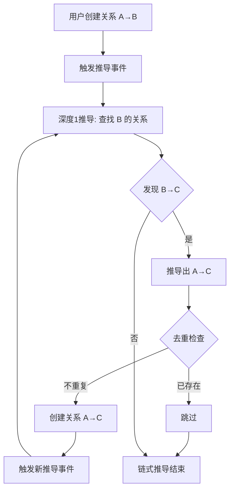

# 关系网 - 关系类型设计规范

## 文档说明

本文档为"关系网"小程序的**关系类型设计规范**，为开发者、用户和 AI Agent 提供标准化的关系类型设计指导。

**设计理念**：
- 🔓 **开放定义**：任何人都可以定义和分享关系类型
- 🤝 **社区共建**：鼓励用户贡献和改进关系类型
- 📊 **数据库驱动**：类型定义存储在数据库，动态加载使用
- 🎨 **即插即用**：定义类型后立即可用，无需修改代码

**目标读者**：
- 关系类型开发者
- AI Agent（用于自动生成关系类型）
- 系统集成人员
- 高级用户

**文档用途**：
- 理解关系类型的结构和约束
- 学习如何设计新的关系类型
- 参考系统预装类型的实现示例
- 了解类型的导出和分享机制

---

## 目录

- [1. 关系类型概述](#1.-关系类型概述)
  - [1.1 什么是关系类型](#1.1-什么是关系类型)
  - [1.2 关系类型的作用](#1.2-关系类型的作用)
  - [1.3 数据库驱动的类型系统](#1.3-数据库驱动的类型系统)
  - [1.4 设计原则](#1.4-设计原则)
- [2. 类型定义规范](#2.-类型定义规范)
  - [2.1 类型元数据](#2.1-类型元数据)
  - [2.2 类型ID命名规范](#2.2-类型id命名规范)
  - [2.3 分类（Category）规范](#2.3-分类（category）规范)
- [3. 字段定义规范](#3.-字段定义规范)
  - [3.1 字段结构](#3.1-字段结构)
  - [3.2 支持的字段类型](#3.2-支持的字段类型)
  - [3.3 字段命名规范](#3.3-字段命名规范)
  - [3.4 字段设计建议](#3.4-字段设计建议)
- [4. 配置项说明](#4.-配置项说明)
  - [4.1 配置结构](#4.1-配置结构)
  - [4.2 配置项详解](#4.2-配置项详解)
- [5. 关系推导与事件驱动](#5.-关系推导与事件驱动)
  - [5.1 关系推导概述](#5.1-关系推导概述)
  - [5.2 推导配置](#5.2-推导配置)
  - [5.3 推导规则定义](#5.3-推导规则定义)
  - [5.4 事件驱动架构](#5.4-事件驱动架构)
  - [5.5 微信小程序中的实现方式](#5.5-微信小程序中的实现方式)
  - [5.6 推导规则的同义词匹配](#5.6-推导规则的同义词匹配)
  - [5.7 推导结果的存储和标识](#5.7-推导结果的存储和标识)
  - [5.8 推导算法实现](#5.8-推导算法实现)
  - [5.10 推导任务的性能优化](#5.10-推导任务的性能优化)
  - [5.11 推导策略对比](#5.11-推导策略对比)
  - [5.12 推导功能的开关控制](#5.12-推导功能的开关控制)
  - [5.13 推导系统的最佳实践](#5.13-推导系统的最佳实践)
  - [5.14 推导功能的测试要点](#5.14-推导功能的测试要点)
- [6. 国际化规范](#6.-国际化规范)
  - [6.1 国际化键命名规范](#6.1-国际化键命名规范)
  - [6.2 必须提供的国际化内容](#6.2-必须提供的国际化内容)
- [7. 验证规则](#7.-验证规则)
  - [7.1 类型级验证](#7.1-类型级验证)
  - [7.2 字段级验证](#7.2-字段级验证)
  - [7.3 业务逻辑验证](#7.3-业务逻辑验证)
- [8. 开发流程](#8.-开发流程)
  - [8.1 设计阶段](#8.1-设计阶段)
  - [8.2 实现方式](#8.2-实现方式)
  - [8.3 系统如何使用类型](#8.3-系统如何使用类型)
  - [8.4 测试阶段](#8.4-测试阶段)
- [9. 类型的导入导出与分享](#9.-类型的导入导出与分享)
  - [9.1 导出类型定义](#9.1-导出类型定义)
  - [9.2 导入类型定义](#9.2-导入类型定义)
  - [9.3 类型分享机制](#9.3-类型分享机制)
  - [9.4 类型版本管理](#9.4-类型版本管理)
- [10. 系统预装类型索引](#10.-系统预装类型索引)
- [11. 完整示例](#11.-完整示例)
  - [11.1 简单示例：邻居关系](#11.1-简单示例：邻居关系)
  - [11.2 复杂示例：同事关系](#11.2-复杂示例：同事关系)
- [11. 常见问题](#11.-常见问题)
- [11. 检查清单](#11.-检查清单)
- [12. 参考资料](#12.-参考资料)
- [附录：字段类型使用指南](#附录：字段类型使用指南)
  - [A.1 string vs text](#a.1-string-vs-text)
  - [A.2 select vs multiSelect](#a.2-select-vs-multiselect)
  - [A.3 date vs datetime](#a.3-date-vs-datetime)
- [变更记录](#变更记录)

---

## 1. 关系类型概述

### 1.1 什么是关系类型

关系类型（GuanxiType）定义了人物之间关系的分类和属性结构。每种关系类型都包含：
- **基本信息**：名称、图标、分类
- **专属属性字段**：该类型关系特有的属性定义
- **配置选项**：控制关系行为的配置
- **国际化支持**：多语言名称和字段标签

### 1.2 关系类型的作用

1. **结构化数据**：为不同类型的关系定义统一的数据结构
2. **动态表单**：根据类型定义自动生成创建/编辑表单
3. **数据验证**：根据字段定义验证用户输入
4. **可视化**：为图谱展示提供颜色、图标等视觉元素
5. **开放扩展**：任何人都可以定义、修改、分享关系类型

### 1.3 数据库驱动的类型系统

**核心机制**：
- ✅ **数据库为唯一真实来源**：所有类型定义存储在 `guanxi_types` 集合（本地IndexedDB）
- ✅ **动态加载**：前端运行时从本地数据库读取类型定义
- ✅ **即时生效**：新增或修改类型后立即可用，无需重启应用
- ✅ **本地执行**：所有验证、推导、事件处理逻辑在前端本地执行
- ✅ **可选云同步**：类型定义可选择性同步到云端作为备份

**数据流向**：
```
本地 IndexedDB - guanxi_types 集合（主存储）
    ↓ 读取
前端小程序：
  - 动态生成表单、类型选择器、图谱样式
  - 验证attributes、执行推导规则、触发事件处理（本地运行）
    ↓ 可选同步
云端备份（可选）：
  - 仅在用户启用云同步时参与
```

**类型来源**：
- 系统预装类型（首次安装时导入）
- 用户自定义类型
- 从社区导入的类型
- AI Agent 生成的类型

所有类型在技术上完全平等，都通过相同的方式集成和使用。

### 1.4 设计原则

- **最小化原则**：只定义必要的字段，避免冗余
- **用户友好**：字段名称和标签要清晰易懂
- **国际化优先**：所有文本内容必须支持国际化
- **验证完整**：提供充分的验证规则，保证数据质量
- **文档完整**：每个字段都要有清晰的说明和示例
- **开放共享**：设计类型时考虑通用性，便于分享和复用

---

## 2. 类型定义规范

### 2.1 类型元数据

```javascript
{
  // ===== 基本信息（必填） =====
  _id: String,                // 类型ID（全局唯一，建议英文小写加下划线）
  name: String,               // 类型名称（中文）
  nameEn: String,             // 类型名称（英文）
  nameI18nKey: String,        // 国际化键（用于多语言）

  // ===== 视觉标识（必填） =====
  icon: String,               // 图标标识（使用 icon 库中的名称）
  color: String,              // 主题色（HEX格式，如：#FF6B6B）

  // ===== 分类（必填） =====
  category: String,           // 分类：family/social/work/education/neighbor/custom

  // ===== 描述（必填） =====
  description: String,        // 类型描述（中文）
  descriptionEn: String,      // 类型描述（英文）

  // ===== 字段定义（必填，可为空数组） =====
  fields: Array,              // 字段定义列表（见 3. 字段定义规范）

  // ===== 配置（可选） =====
  config: Object,             // 配置选项（见 4. 配置项说明）

  // ===== 国际化资源（可选） =====
  i18n: Object,               // 多语言翻译（见 6. 国际化规范）

  // ===== 元数据 =====
  version: String,            // 类型定义版本（如：1.0.0）
  author: String,             // 作者（用户ID或组织名）
  isEnabled: Boolean,         // 是否启用（默认true）
  isPublic: Boolean,          // 是否公开分享（默认false）
  downloads: Number,          // 下载/使用次数
  tags: [String],             // 标签（便于搜索和分类）

  createdBy: String,          // 创建者用户ID
  createdAt: Date,
  updatedAt: Date
}
```

### 2.2 类型ID命名规范

**格式**：`[category]_[specific_name]`

**示例**：
- `family_parent` - 亲子关系
- `family_relative` - 一般亲属关系
- `social_friend` - 好友关系
- `work_colleague` - 同事关系
- `education_classmate` - 同学关系
- `neighbor_community` - 邻里关系

**规则**：
- 全部小写
- 使用下划线分隔
- 语义清晰
- 避免与预置类型冲突

### 2.3 分类（Category）规范

| 分类值 | 中文名 | 英文名 | 说明 |
|--------|--------|--------|------|
| family | 家庭关系 | Family | 亲戚、家族关系 |
| social | 社交关系 | Social | 朋友、社交圈关系 |
| work | 工作关系 | Work | 同事、合作伙伴等 |
| education | 教育关系 | Education | 同学、师生关系 |
| neighbor | 邻里关系 | Neighbor | 邻居、社区关系 |
| custom | 自定义 | Custom | 用户自定义类型 |

---

## 3. 字段定义规范

### 3.1 字段结构

每个字段定义为一个对象：

```javascript
{
  // ===== 基本信息（必填） =====
  name: String,               // 字段名（英文，驼峰命名）
  label: String,              // 字段标签（中文）
  labelEn: String,            // 字段标签（英文）
  labelI18nKey: String,       // 国际化键

  // ===== 字段类型（必填） =====
  type: String,               // 字段类型（见 3.2）

  // ===== 验证规则（可选） =====
  required: Boolean,          // 是否必填（默认false）
  defaultValue: Any,          // 默认值

  // ===== 选项（type为select/multiSelect时必填） =====
  options: [{
    value: String,            // 选项值
    label: String,            // 选项标签（中文）
    labelEn: String,          // 选项标签（英文）
    labelI18nKey: String      // 国际化键
  }],

  // ===== UI配置（可选） =====
  placeholder: String,        // 占位符文本（中文）
  placeholderEn: String,      // 占位符文本（英文）
  placeholderI18nKey: String, // 国际化键
  helpText: String,           // 帮助文本
  displayOrder: Number,       // 显示顺序（默认按数组顺序）

  // ===== 验证规则（可选） =====
  validation: {
    min: Number,              // 最小值/最小长度
    max: Number,              // 最大值/最大长度
    pattern: String,          // 正则表达式
    message: String,          // 验证失败提示
    messageEn: String,        // 英文提示
    messageI18nKey: String    // 国际化键
  }
}
```

### 3.2 支持的字段类型

| 类型 | 说明 | 存储格式 | UI组件 |
|------|------|----------|--------|
| string | 字符串 | String | input[type=text] |
| text | 长文本 | String | textarea |
| number | 数字 | Number | input[type=number] |
| date | 日期 | String (YYYY-MM-DD) | date-picker |
| datetime | 日期时间 | String (ISO 8601) | datetime-picker |
| select | 单选 | String | select/radio |
| multiSelect | 多选 | Array[String] | checkbox-group |
| boolean | 布尔值 | Boolean | switch |
| phone | 电话 | String | input[type=tel] |
| email | 邮箱 | String | input[type=email] |
| url | 链接 | String | input[type=url] |

### 3.3 字段命名规范

**格式**：驼峰命名（camelCase）

**常用字段名参考**：
- `title` - 称谓/关系名称
- `metAt` - 认识场合
- `startDate` - 开始日期
- `company` - 公司名称
- `department` - 部门
- `school` - 学校名称
- `grade` - 年级
- `address` - 地址
- `level` - 等级/级别
- `frequency` - 频率

### 3.4 字段设计建议

**必填字段**：
- 至少有1个必填字段（通常是核心的描述性字段，如称谓、公司名等）
- 不要过多必填字段（建议不超过3个），降低用户输入负担

**字段数量**：
- 建议 3-8 个字段
- 少于3个可能信息不足
- 多于8个用户体验差，考虑拆分为多个类型

**选项设计**：
- select 类型的 options 建议 2-10 个选项
- 选项要覆盖常见情况
- 提供"其他"选项兜底

---

## 4. 配置项说明

### 4.1 配置结构

```javascript
config: {
  // ===== 时间段支持（可选） =====
  supportMultiPeriod: Boolean,    // 是否支持多时间段（默认true）
  requirePeriod: Boolean,         // 是否必须有时间段（默认false）

  // ===== 关系方向（可选） =====
  bidirectional: Boolean,         // 是否双向关系（默认true）

  // ===== 显示控制（可选） =====
  showInGraph: Boolean,           // 是否在图谱中显示（默认true）
  priority: Number,               // 显示优先级（0-100，默认50）

  // ===== 扩展配置（可选） =====
  allowDuplicate: Boolean,        // 是否允许同一对人物建立多个该类型关系（默认false）
  autoReminder: Boolean,          // 是否自动创建提醒（默认false）
  reminderRules: Array,           // 提醒规则定义

  // ===== 关系推导配置（可选） =====
  enableDeduction: Boolean,       // 是否启用关系推导（默认false）
  deductionRules: Array,          // 推导规则定义（见第5章）
  deductionDepth: Number,         // 单次推导深度（默认1，推导关系会链式触发新推导）
  autoCreateDeduced: Boolean      // 是否自动创建推导关系（默认false，需用户确认）
}
```

### 4.2 配置项详解

#### supportMultiPeriod
- **作用**：控制关系是否支持多个时间段
- **适用场景**：
  - `true`：适合可能中断再续的关系（如同事、朋友）
  - `false`：适合持续性关系（如亲属关系）
- **默认值**：`true`

#### requirePeriod
- **作用**：是否必须指定时间段
- **适用场景**：
  - `true`：适合有明确时间范围的关系（如同学、同事）
  - `false`：适合时间范围不明确的关系（如亲戚、朋友）
- **默认值**：`false`

#### bidirectional
- **作用**：关系是否双向
- **适用场景**：
  - `true`：对等关系（好友、同事、同学）
  - `false`：非对等关系（上下级、师生）
- **默认值**：`true`

#### priority
- **作用**：控制在列表、图谱中的显示优先级
- **范围**：0-100（数值越大优先级越高）
- **建议**：
  - 家庭关系：80-100
  - 工作关系：60-79
  - 社交关系：40-59
  - 其他关系：20-39

---

## 5. 关系推导与事件驱动

### 5.1 关系推导概述

某些关系类型（特别是**亲属关系**）具有**传递性和可推导性**。基于已建立的基础关系，系统可以自动推导出隐含的关系，大幅减少用户输入工作量。

**核心价值**：
- 🎯 减少输入：只需录入核心关系，自动生成衍生关系
- 🔍 发现隐藏关系：自动发现间接的亲属关系
- ✅ 保证完整性：确保关系网的完整性和一致性
- 🔄 链式推导：新创建的推导关系会自动触发下一轮推导，无需一次性深度遍历

**适用类型**：
- **family_relative**（亲属关系）：✅ 强烈推荐启用推导
- **social_friend**（好友关系）：❌ 通常不推导（朋友的朋友不一定是朋友）
- **work_colleague**（同事关系）：⚠️ 部分推导（同事的上级可推导，但需谨慎）
- **education_classmate**（同学关系）：⚠️ 有限推导（同班同学的室友可能认识）
- **neighbor_community**（邻里关系）：❌ 不推导

---

### 5.2 推导配置

#### 5.2.1 配置项定义

在类型的 `config` 中增加推导相关配置：

```javascript
config: {
  // ... 其他配置

  // ===== 关系推导配置 =====
  enableDeduction: Boolean,           // 是否启用关系推导（默认false）
  deductionRules: Array,              // 推导规则定义
  deductionDepth: Number,             // 单次推导深度（默认1，推导关系会链式触发新推导）
  deductionStrategy: String,          // 推导策略（见5.2.3）
  autoCreateDeduced: Boolean,         // 是否自动创建推导关系（默认false）
  deductionConfidenceThreshold: Number, // 自动创建的置信度阈值（默认0.95）

  // ===== 推导控制（可选） =====
  deduplicationEnabled: Boolean,      // 启用去重检查（默认true）
  maxChainLength: Number              // 最大链式推导次数（默认20，防止无限循环）
}
```

#### 5.2.2 推导深度说明（deductionDepth）

**核心机制：链式推导**

推导深度指单次推导操作向外扩展的层数。但由于**推导出的关系在创建后会自动触发新的推导事件**，实际上形成了**链式推导机制**：

```
1. 创建关系 A→B（父子）
   ↓ 触发推导事件
2. 深度1推导：查找 B 的所有关系，发现 B→C（父子）
   ↓ 推导出 A→C（爷孙）
3. 创建推导关系 A→C
   ↓ 触发新的推导事件
4. 深度1推导：查找 C 的所有关系，发现 C→D（父子）
   ↓ 推导出 A→D（曾祖孙）
5. 创建推导关系 A→D
   ↓ 链式继续...
   ...直到没有新关系可推导
```

**推荐配置**：
- **deductionDepth: 1**（默认值）
- 每次只推导1层，依靠链式触发自动完成深层推导
- 避免单次推导大量关系导致性能问题
- 通过去重机制防止重复创建已存在的关系

**关键：去重机制**

在创建推导关系前，必须检查该关系是否已存在（无论是手动创建还是之前推导创建的）：

```javascript
// 推导算法中的去重检查
async function checkDuplicateRelation(fromId, toId, title) {
  const existing = await db.collection('guanxi')
    .where({
      fromCharacterId: fromId,
      toCharacterId: toId,
      'attributes.title': title
    })
    .get();

  return existing.data.length > 0;  // true = 已存在
}

// 创建推导关系时检查
for (const deduced of deducedRelations) {
  const isDuplicate = await checkDuplicateRelation(
    deduced.fromId,
    deduced.toId,
    deduced.attributes.title
  );

  if (!isDuplicate) {
    // 只创建不存在的关系
    await createDeducedRelation(deduced);
  }
}
```

**链式推导终止条件**：
- 所有可推导关系都已存在（去重检查全部命中）
- 达到关系网边界（没有更多关系可匹配规则）
- 达到最大推导次数限制（防止意外的无限循环）

#### 5.2.3 推导策略（deductionStrategy）

| 策略值 | 说明 | 触发时机 | 适用场景 |
|--------|------|----------|----------|
| `realtime` | 实时推导 | 创建/修改关系后立即推导 | **推荐**：配合链式推导机制 |
| `on_demand` | 按需推导 | 用户主动触发或查看人物时 | 用户希望手动控制推导时机 |
| `background` | 后台推导 | 定期后台任务 | 批量修复历史数据的关系网 |
| `hybrid` | 混合模式 | 浅层实时+深层后台 | 兼容旧设计，不推荐 |

**默认值**：`realtime`（配合链式推导机制，实时推导1层即可）

**推荐配置**：
```javascript
// 亲属关系推荐配置
config: {
  enableDeduction: true,
  deductionStrategy: 'realtime',     // 实时推导，依靠链式触发
  deductionDepth: 1,                 // 单次推导1层，通过链式完成深层推导
  autoCreateDeduced: false,          // 需要用户确认
  deductionConfidenceThreshold: 0.95
}
```

---

### 5.3 推导规则定义

#### 5.3.1 规则结构

```javascript
deductionRules: [
  {
    // 规则标识
    ruleId: String,                   // 规则ID（唯一）
    ruleName: String,                 // 规则名称

    // 匹配条件
    pathPattern: [String],            // 关系路径模式（称谓序列）
    pathPatternRegex: String,         // 路径正则（可选，用于灵活匹配）

    // 推导结果
    resultTemplate: {
      title: String,                  // 推导出的称谓
      lineage: String,                // 亲缘类型
      proximity: String,              // 亲缘远近
      generation: Number,             // 世代差（正数=长辈，负数=晚辈）
      attributes: Object              // 其他属性
    },

    // 推导元数据
    confidence: Number,               // 推导置信度（0-1）
    needUserConfirm: Boolean,         // 是否需要用户确认
    priority: Number,                 // 规则优先级（多规则匹配时）

    // 约束条件（可选）
    constraints: {
      minConfidence: Number,          // 最小置信度要求
      requireGender: Boolean,         // 是否需要性别信息辅助判断
      culturalContext: [String]       // 适用的文化背景
    }
  }
]
```

#### 5.3.2 规则示例

```javascript
deductionRules: [
  {
    ruleId: 'father_father_to_grandpa',
    ruleName: '父亲的父亲是爷爷',
    pathPattern: ['父亲', '父亲'],
    resultTemplate: {
      title: '爷爷',
      lineage: 'direct',
      proximity: 'close',
      generation: 2
    },
    confidence: 1.0,
    needUserConfirm: false,
    priority: 100
  },
  {
    ruleId: 'father_brother_to_uncle',
    ruleName: '父亲的兄弟是伯伯或叔叔',
    pathPattern: ['父亲', '兄弟'],
    resultTemplate: {
      title: '伯伯/叔叔',  // 需要用户确认具体称谓
      lineage: 'collateral',
      proximity: 'close',
      generation: 1
    },
    confidence: 0.9,
    needUserConfirm: true,  // 需确认是伯伯还是叔叔
    priority: 90,
    constraints: {
      requireGender: true,   // 需要性别信息
      culturalContext: ['zh-CN']  // 中文文化特有
    }
  }
]
```

---

### 5.4 事件驱动架构

#### 5.4.1 关系生命周期事件

关系类型可以订阅以下事件，在关键时机执行自定义逻辑：

```javascript
// 关系事件枚举
const GuanxiEvents = {
  BEFORE_CREATE: 'guanxi:before_create',      // 创建关系前
  AFTER_CREATE: 'guanxi:after_create',        // 创建关系后
  BEFORE_UPDATE: 'guanxi:before_update',      // 更新关系前
  AFTER_UPDATE: 'guanxi:after_update',        // 更新关系后
  BEFORE_DELETE: 'guanxi:before_delete',      // 删除关系前
  AFTER_DELETE: 'guanxi:after_delete'         // 删除关系后
};
```

#### 5.4.2 事件处理器定义

在关系类型类中定义事件处理器：

```javascript
class FamilyRelativeType extends BaseGuanxiType {
  constructor() {
    super({ /* 配置 */ });

    // 注册事件处理器
    this.registerEventHandlers();
  }

  /**
   * 注册事件处理器
   */
  registerEventHandlers() {
    // 创建关系后触发推导
    this.on('after_create', this.handleAfterCreate.bind(this));

    // 更新关系后重新推导
    this.on('after_update', this.handleAfterUpdate.bind(this));

    // 删除关系前处理推导关系
    this.on('before_delete', this.handleBeforeDelete.bind(this));
  }

  /**
   * 创建关系后的处理
   * 这是触发推导的主要时机
   */
  async handleAfterCreate(event) {
    const { guanxi, context } = event;

    // 检查是否启用推导
    if (!this.config.enableDeduction) return;

    try {
      // 触发关系推导（深度1）
      const deductor = context.getService('familyDeductor');
      const deducedRelations = await deductor.deduceFromNewRelation(
        guanxi,
        this
      );

      // 根据策略处理推导结果
      await this.processDeductionResults(deducedRelations, context);

    } catch (error) {
      console.error('关系推导失败:', error);
      // 推导失败不影响主流程
    }
  }

  /**
   * 处理推导结果（包含去重检查）
   */
  async processDeductionResults(deducedRelations, context) {
    const autoCreated = [];
    const needConfirm = [];
    const duplicates = [];

    for (const deduced of deducedRelations) {
      // 去重检查：是否已存在相同关系
      const isDuplicate = await this.checkDuplicateRelation(
        deduced.fromCharacterId,
        deduced.toCharacterId,
        deduced.attributes.title,
        context
      );

      if (isDuplicate) {
        duplicates.push(deduced);
        continue;  // 跳过已存在的关系
      }

      // 根据置信度和配置决定处理方式
      if (deduced.confidence >= this.config.deductionConfidenceThreshold &&
          !deduced.needUserConfirm &&
          this.config.autoCreateDeduced) {
        // 自动创建高置信度关系
        await this.autoCreateDeducedRelation(deduced, context);
        autoCreated.push(deduced);
      } else {
        // 加入待确认列表
        needConfirm.push(deduced);
      }
    }

    // 通知用户
    if (autoCreated.length > 0) {
      context.notify({
        type: 'success',
        message: `自动推导出 ${autoCreated.length} 个关系`,
        action: 'view_deduced'
      });
    }

    if (needConfirm.length > 0) {
      context.notify({
        type: 'info',
        message: `发现 ${needConfirm.length} 个潜在关系，需要确认`,
        action: 'confirm_deduced',
        data: needConfirm
      });
    }

    // 记录去重信息（用于调试）
    if (duplicates.length > 0) {
      console.log(`去重：跳过 ${duplicates.length} 个已存在的关系`);
    }
  }

  /**
   * 检查关系是否已存在（去重）
   */
  async checkDuplicateRelation(fromId, toId, title, context) {
    const db = context.getDatabase();
    const result = await db.collection('guanxi')
      .where({
        fromCharacterId: fromId,
        toCharacterId: toId,
        'attributes.title': title
      })
      .count();

    return result.total > 0;
  }
}
```

---

### 5.5 微信小程序中的实现方式

#### 5.5.1 事件总线实现

微信小程序原生不提供事件总线，需要自行实现：

```javascript
// utils/event-bus.js

/**
 * 全局事件总线（单例模式）
 */
class EventBus {
  constructor() {
    if (EventBus.instance) {
      return EventBus.instance;
    }
    this.listeners = {};
    EventBus.instance = this;
  }

  /**
   * 订阅事件
   * @param {String} event - 事件名
   * @param {Function} handler - 处理函数
   * @param {Object} options - 选项
   */
  on(event, handler, options = {}) {
    if (!this.listeners[event]) {
      this.listeners[event] = [];
    }

    this.listeners[event].push({
      handler,
      priority: options.priority || 0,
      once: options.once || false,
      async: options.async || false
    });

    // 按优先级排序
    this.listeners[event].sort((a, b) => b.priority - a.priority);
  }

  /**
   * 发布事件
   * @param {String} event - 事件名
   * @param {Object} data - 事件数据
   */
  async emit(event, data) {
    const handlers = this.listeners[event] || [];
    const results = [];

    for (const item of handlers) {
      try {
        if (item.async) {
          // 异步执行，不阻塞后续处理
          item.handler(data).catch(err => {
            console.error(`异步事件处理失败 [${event}]:`, err);
          });
        } else {
          // 同步执行
          const result = await item.handler(data);
          results.push(result);
        }

        // once: true 的处理器执行一次后移除
        if (item.once) {
          this.off(event, item.handler);
        }
      } catch (error) {
        console.error(`事件处理失败 [${event}]:`, error);
        // 继续执行其他处理器
      }
    }

    return results;
  }

  /**
   * 取消订阅
   */
  off(event, handler) {
    if (!this.listeners[event]) return;
    this.listeners[event] = this.listeners[event].filter(
      item => item.handler !== handler
    );
  }

  /**
   * 清空所有监听器
   */
  clear() {
    this.listeners = {};
  }
}

// 导出单例
export default new EventBus();
```

---

#### 5.5.2 关系服务中集成事件

```javascript
// services/guanxi.service.js
import EventBus from '../utils/event-bus';
import { getGuanxiType } from './guanxi-type.service';

/**
 * 创建关系
 */
async function createGuanxi(guanxiData) {
  const typeInstance = await getGuanxiType(guanxiData.typeId);

  // 1. 触发 before_create 事件
  const beforeEvent = {
    type: 'before_create',
    guanxi: guanxiData,
    typeInstance: typeInstance,
    context: this.getContext()
  };

  const beforeResults = await EventBus.emit('guanxi:before_create', beforeEvent);

  // 检查是否被拦截
  if (beforeResults.some(r => r?.prevent)) {
    throw new Error('创建关系被拦截');
  }

  // 2. 执行创建
  const db = wx.cloud.database();  // 或 IndexedDB
  const result = await db.collection('guanxi').add({
    data: {
      ...guanxiData,
      createdAt: new Date(),
      updatedAt: new Date()
    }
  });

  const createdGuanxi = {
    _id: result._id,
    ...guanxiData
  };

  // 3. 触发 after_create 事件（异步，不阻塞主流程）
  const afterEvent = {
    type: 'after_create',
    guanxi: createdGuanxi,
    typeInstance: typeInstance,
    context: this.getContext()
  };

  // 异步触发，不等待结果
  EventBus.emit('guanxi:after_create', afterEvent);

  return createdGuanxi;
}
```

---

#### 5.5.3 推导服务订阅事件

```javascript
// services/family-deduction.service.js
import EventBus from '../utils/event-bus';

/**
 * 家族关系推导服务
 */
class FamilyDeductionService {
  constructor() {
    this.init();
  }

  /**
   * 初始化：订阅关系事件
   */
  init() {
    // 订阅"创建关系后"事件
    EventBus.on('guanxi:after_create', async (event) => {
      await this.handleGuanxiCreated(event);
    }, {
      priority: 10,    // 优先级（较高）
      async: true      // 异步执行，不阻塞主流程
    });

    // 订阅"更新关系后"事件
    EventBus.on('guanxi:after_update', async (event) => {
      await this.handleGuanxiUpdated(event);
    }, {
      async: true
    });

    console.log('家族关系推导服务已启动');
  }

  /**
   * 处理"关系创建"事件
   */
  async handleGuanxiCreated(event) {
    const { guanxi, typeInstance, context } = event;

    // 只处理启用推导的类型
    if (!typeInstance.config.enableDeduction) {
      return;
    }

    console.log(`触发推导: ${guanxi.fromCharacterId} -> ${guanxi.toCharacterId}`);

    try {
      // 执行推导
      const strategy = typeInstance.config.deductionStrategy || 'hybrid';

      if (strategy === 'realtime' || strategy === 'hybrid') {
        // 实时推导（浅层）
        await this.deduceRealtime(guanxi, typeInstance, context);
      }

      if (strategy === 'background' || strategy === 'hybrid') {
        // 后台推导（深层）
        this.scheduleBackgroundDeduction(guanxi, typeInstance);
      }

    } catch (error) {
      console.error('推导失败:', error);
    }
  }

  /**
   * 实时推导（单层，依靠链式触发）
   */
  async deduceRealtime(guanxi, typeInstance, context) {
    const depth = 1;  // 单次推导深度为1，依靠链式触发完成深层推导
    const deducedRelations = await this.deduceRelations(
      guanxi.fromCharacterId,
      guanxi.toCharacterId,
      depth,
      typeInstance.deductionRules
    );

    // 处理推导结果
    await this.processDeductionResults(
      deducedRelations,
      typeInstance,
      context
    );
  }

  /**
   * 调度后台推导任务
   */
  scheduleBackgroundDeduction(guanxi, typeInstance) {
    // 使用小程序的后台任务API（如果可用）
    // 或使用云函数定时触发器
    wx.cloud.callFunction({
      name: 'deduceRelations',
      data: {
        guanxiId: guanxi._id,
        depth: typeInstance.config.deductionDepth || 1
      }
    }).catch(err => {
      console.error('后台推导任务调度失败:', err);
    });
  }
}

// 在 app.js 中初始化服务
App({
  onLaunch() {
    // 启动推导服务
    const deductionService = new FamilyDeductionService();
  }
});
```

---

### 5.6 推导规则的同义词匹配

为了支持灵活的称谓匹配，需要定义同义词映射：

```javascript
// config/kinship-synonyms.js

/**
 * 亲属称谓同义词映射
 * 用于推导规则的模糊匹配
 */
export const kinshipSynonyms = {
  // 父亲类
  'father': ['父亲', '爸爸', '爹', '爸', '父', 'dad', 'father', 'papa'],

  // 母亲类
  'mother': ['母亲', '妈妈', '娘', '妈', '母', 'mom', 'mother', 'mama'],

  // 兄弟类
  'brother': ['兄弟', '哥哥', '弟弟', '兄', '弟', 'brother', 'bro'],

  // 姐妹类
  'sister': ['姐妹', '姐姐', '妹妹', '姐', '妹', 'sister', 'sis'],

  // 配偶类
  'spouse': ['配偶', '妻子', '丈夫', '老婆', '老公', '爱人', 'spouse', 'wife', 'husband'],

  // 子女类
  'son': ['儿子', '子', 'son'],
  'daughter': ['女儿', '女', 'daughter'],

  // 其他
  'grandparent': ['祖父母', '爷爷', '奶奶', '外公', '外婆', 'grandparent'],
  'uncle': ['伯伯', '叔叔', '舅舅', 'uncle'],
  'aunt': ['姑姑', '姨妈', 'aunt']
};

/**
 * 检查两个称谓是否匹配（考虑同义词）
 */
export function matchKinship(actual, pattern) {
  if (actual === pattern) return true;

  for (const [key, synonyms] of Object.entries(kinshipSynonyms)) {
    if (synonyms.includes(pattern) && synonyms.includes(actual)) {
      return true;
    }
  }

  return false;
}
```

---

### 5.7 推导结果的存储和标识

#### 5.7.1 guanxi 集合扩展字段

```javascript
// guanxi 文档结构扩展
{
  _id: String,
  userId: String,
  fromCharacterId: String,
  toCharacterId: String,
  typeId: String,
  attributes: Object,
  periods: Array,

  // ===== 关系来源标识（新增） =====
  source: String,              // 'manual'（手动创建）/ 'deduced'（推导创建）

  // ===== 推导信息（仅推导关系） =====
  deductionInfo: {
    strategy: String,          // 推导策略：realtime/background
    basedOn: [String],         // 基于哪些关系推导（guanxi ID数组）
    path: [String],            // 推导路径（称谓数组）
    ruleId: String,            // 使用的推导规则ID
    confidence: Number,        // 推导置信度（0-1）
    deducedAt: Date,           // 推导时间
    deducedBy: String          // 推导引擎版本
  },

  // ===== 确认状态（仅推导关系） =====
  isConfirmed: Boolean,        // 是否已被用户确认
  confirmedAt: Date,           // 确认时间
  modifiedFromDeduction: Boolean, // 用户是否修改了推导结果

  // 标准字段
  createdAt: Date,
  updatedAt: Date
}
```

#### 5.7.2 推导关系的查询

```javascript
// 查询所有推导关系
const deducedRelations = await db.collection('guanxi')
  .where({
    source: 'deduced',
    isConfirmed: false
  })
  .get();

// 查询基于特定关系的推导
const basedOnRelations = await db.collection('guanxi')
  .where({
    'deductionInfo.basedOn': db.command.in([baseGuanxiId])
  })
  .get();
```

---

### 5.8 推导算法实现

#### 5.8.1 链式推导核心算法

```javascript
/**
 * 推导服务类
 * 实现深度1推导 + 链式触发机制
 */
class RelationDeductor {
  constructor(db, eventBus) {
    this.db = db;
    this.eventBus = eventBus;
    this.deductionChains = new Map();  // 追踪正在进行的链式推导
  }

  /**
   * 从新关系触发推导
   * @param {Object} guanxi - 新创建的关系
   * @param {Object} typeInstance - 关系类型实例
   * @returns {Array} 推导出的关系列表
   */
  async deduceFromNewRelation(guanxi, typeInstance) {
    const { fromCharacterId, toCharacterId } = guanxi;
    const depth = typeInstance.config.deductionDepth || 1;
    const rules = typeInstance.config.deductionRules;

    // 防止无限循环：检查链式推导次数
    const chainKey = `${fromCharacterId}_${toCharacterId}`;
    const chainCount = this.deductionChains.get(chainKey) || 0;
    const maxChainLength = typeInstance.config.maxChainLength || 20;

    if (chainCount >= maxChainLength) {
      console.warn(`链式推导达到最大次数 ${maxChainLength}，终止推导`);
      this.deductionChains.delete(chainKey);
      return [];
    }

    // 更新链式计数
    this.deductionChains.set(chainKey, chainCount + 1);

    const deducedRelations = [];

    // 只推导1层：查找与 toCharacterId 相关的所有关系
    const relatedRelations = await this.db.collection('guanxi')
      .where({
        fromCharacterId: toCharacterId,
        typeId: guanxi.typeId  // 同类型关系
      })
      .get();

    for (const related of relatedRelations.data) {
      // 尝试匹配推导规则
      const path = [
        guanxi.attributes.title,
        related.attributes.title
      ];

      const matchedRule = this.matchRule(path, rules);
      if (!matchedRule) continue;

      // 去重检查：是否已存在该关系
      const isDuplicate = await this.checkDuplicateRelation(
        fromCharacterId,
        related.toCharacterId,
        matchedRule.resultTemplate.title
      );

      if (isDuplicate) {
        console.log(`去重：关系已存在 ${fromCharacterId} → ${related.toCharacterId}`);
        continue;
      }

      // 构建推导关系
      const deducedRelation = {
        fromCharacterId: fromCharacterId,
        toCharacterId: related.toCharacterId,
        typeId: guanxi.typeId,
        attributes: { ...matchedRule.resultTemplate },
        source: 'deduced',
        deductionInfo: {
          strategy: typeInstance.config.deductionStrategy,
          basedOn: [guanxi._id, related._id],
          path: path,
          ruleId: matchedRule.ruleId,
          confidence: matchedRule.confidence,
          deducedAt: new Date()
        }
      };

      deducedRelations.push(deducedRelation);
    }

    // 清理计数（推导完成）
    if (deducedRelations.length === 0) {
      this.deductionChains.delete(chainKey);
    }

    return deducedRelations;
  }

  /**
   * 去重检查：关系是否已存在
   */
  async checkDuplicateRelation(fromId, toId, title) {
    const result = await this.db.collection('guanxi')
      .where({
        fromCharacterId: fromId,
        toCharacterId: toId,
        'attributes.title': title
      })
      .count();

    return result.total > 0;
  }

  /**
   * 匹配推导规则
   */
  matchRule(path, rules) {
    for (const rule of rules) {
      if (this.pathMatches(path, rule.pathPattern)) {
        return rule;
      }
    }
    return null;
  }

  /**
   * 路径匹配（支持同义词）
   */
  pathMatches(path, pattern) {
    if (path.length !== pattern.length) return false;

    for (let i = 0; i < path.length; i++) {
      if (!this.titleMatches(path[i], pattern[i])) {
        return false;
      }
    }
    return true;
  }

  /**
   * 称谓匹配（支持同义词）
   */
  titleMatches(title, pattern) {
    // 同义词映射（详见5.6节）
    const synonyms = {
      '父亲': ['爸爸', 'dad', 'father', '父'],
      '母亲': ['妈妈', 'mom', 'mother', '母'],
      // ...
    };

    // 精确匹配
    if (title === pattern) return true;

    // 同义词匹配
    for (const [key, values] of Object.entries(synonyms)) {
      if ((key === pattern || values.includes(pattern)) &&
          (key === title || values.includes(title))) {
        return true;
      }
    }

    return false;
  }
}
```

#### 5.8.2 链式推导的事件流

```javascript
// 在 EventBus 中注册推导处理器
eventBus.on('guanxi:after_create', async (event) => {
  const { guanxi, typeInstance } = event;

  // 只有启用推导的类型才触发
  if (!typeInstance.config.enableDeduction) return;

  // 执行推导
  const deductor = new RelationDeductor(db, eventBus);
  const deducedRelations = await deductor.deduceFromNewRelation(
    guanxi,
    typeInstance
  );

  // 处理推导结果（可能包括自动创建）
  for (const deduced of deducedRelations) {
    if (shouldAutoCreate(deduced, typeInstance.config)) {
      // 创建推导关系 → 触发新的 after_create 事件 → 链式推导
      await createGuanxi(deduced);
    } else {
      // 保存为待确认的推导建议
      await saveSuggestion(deduced);
    }
  }
});
```

**链式推导示例**：

假设规则库：
- `['父亲', '父亲'] → '爷爷'`
- `['父亲', '兄弟'] → '伯伯/叔叔'`
- `['爷爷', '兄弟'] → '伯公/叔公'`

执行流程：
```
步骤1: 用户创建 [小明 → 爸爸, title='父亲']
  ↓ 触发 after_create 事件
  ↓ 推导深度1，未发现新关系（爸爸还没有父亲）

步骤2: 用户创建 [爸爸 → 爷爷, title='父亲']
  ↓ 触发 after_create 事件
  ↓ 推导深度1，查找爷爷的关系
  ↓ 匹配规则：['父亲', '父亲'] → '爷爷'
  ↓ 去重检查：小明→爷爷 不存在
  ↓ 创建推导关系 [小明 → 爷爷, title='爷爷', source='deduced']
  ↓ 触发新的 after_create 事件
  ↓ 推导深度1，查找爷爷的关系（假设爷爷有兄弟）
  ↓ 匹配规则：['爷爷', '兄弟'] → '伯公/叔公'
  ↓ 去重检查通过
  ↓ 创建推导关系 [小明 → 伯公, title='伯公', source='deduced']
  ↓ 触发新的 after_create 事件
  ↓ ...继续链式推导
  ↓ 直到没有新关系可推导
```

---

### 5.10 推导任务的性能优化

#### 5.10.1 使用 Web Worker（小程序Worker）

```javascript
// workers/deduction.worker.js

/**
 * 推导计算 Worker
 * 在独立线程中执行推导，避免阻塞UI
 */
worker.onMessage((message) => {
  const { action, data } = message;

  switch (action) {
    case 'deduce':
      const result = performDeduction(data);
      worker.postMessage({
        type: 'deduction_result',
        data: result
      });
      break;
  }
});

function performDeduction({ guanxiId, depth, rules }) {
  // 执行推导计算
  // ...
  return deducedRelations;
}
```

```javascript
// 主线程调用 Worker
const worker = wx.createWorker('workers/deduction.worker.js');

worker.postMessage({
  action: 'deduce',
  data: {
    guanxiId: 'xxx',
    depth: 1,  // 单次推导1层
    rules: deductionRules
  }
});

worker.onMessage((message) => {
  if (message.type === 'deduction_result') {
    handleDeductionResults(message.data);
  }
});
```

---

#### 5.10.2 使用云函数（Cloud Function）

对于批量修复历史数据的场景，可以使用云函数：

```javascript
// cloudfunctions/deduceRelations/index.js

const cloud = require('wx-server-sdk');
cloud.init({ env: cloud.DYNAMIC_CURRENT_ENV });
const db = cloud.database();

exports.main = async (event, context) => {
  const { guanxiId, depth } = event;

  try {
    // 查询关系详情
    const guanxi = await db.collection('guanxi').doc(guanxiId).get();

    // 执行推导（可使用更多计算资源）
    const deductor = new FamilyRelationDeductor();
    const deducedRelations = await deductor.deduceFromRelation(
      guanxi.data,
      depth
    );

    // 保存推导结果到临时集合
    await db.collection('deduction_suggestions').add({
      data: {
        userId: guanxi.data.userId,
        baseGuanxiId: guanxiId,
        suggestions: deducedRelations,
        createdAt: new Date(),
        expiresAt: new Date(Date.now() + 7 * 24 * 3600 * 1000)  // 7天过期
      }
    });

    return {
      success: true,
      count: deducedRelations.length
    };

  } catch (error) {
    console.error('云函数推导失败:', error);
    return {
      success: false,
      error: error.message
    };
  }
};
```

---

#### 5.10.3 使用数据库触发器（Database Trigger）

如果使用云开发，可以利用数据库触发器：

```javascript
// cloudfunctions/guanxi-trigger/index.js

/**
 * 数据库触发器：guanxi 集合的 onCreate 事件
 */
exports.main = async (event, context) => {
  const { data, dataType } = event;

  // dataType === 'create' 表示新建文档
  if (dataType === 'create') {
    const guanxi = data;

    // 查询关系类型配置
    const db = cloud.database();
    const typeDoc = await db.collection('guanxi_types')
      .doc(guanxi.typeId)
      .get();

    const typeConfig = typeDoc.data;

    // 检查是否启用推导
    if (typeConfig.config?.enableDeduction) {
      // 调用推导云函数（异步）
      cloud.callFunction({
        name: 'deduceRelations',
        data: {
          guanxiId: guanxi._id,
          depth: typeConfig.config.deductionDepth || 1
        }
      });
    }
  }

  return { success: true };
};
```

**配置触发器**：
```json
// cloudfunctions/guanxi-trigger/config.json
{
  "triggers": [
    {
      "name": "guanxiOnCreate",
      "type": "db",
      "config": {
        "collection": "guanxi",
        "events": ["create"]
      }
    }
  ]
}
```

---

### 5.11 推导策略对比

#### 5.11.1 四种实现方式对比

| 方案 | 优点 | 缺点 | 适用场景 | 推荐度 |
|------|------|------|----------|--------|
| **事件总线 + 同步推导** | 实现简单，结果即时，配合链式推导效果好 | 单次推导阻塞UI | **推荐**：深度1推导 + 链式触发 | ⭐⭐⭐⭐⭐ |
| **事件总线 + Web Worker** | 不阻塞UI，性能好 | 实现复杂，Worker限制 | 深度1推导且规则复杂时 | ⭐⭐⭐⭐ |
| **云函数异步推导** | 计算能力强，不占客户端资源 | 需要网络，延迟较高 | 批量修复历史数据 | ⭐⭐⭐ |
| **数据库触发器** | 自动触发，无需手动调用 | 仅云开发支持，调试困难 | 后台自动化场景 | ⭐⭐ |

#### 5.11.2 推荐架构（链式推导）

```javascript
// 推荐的链式推导架构（简化版）
config: {
  enableDeduction: true,
  deductionStrategy: 'realtime',  // 实时推导
  deductionDepth: 1,              // 单次推导1层，依靠链式触发

  // 去重和终止控制
  deduplicationEnabled: true,      // 启用去重检查（默认true）
  maxChainLength: 20,              // 最大链式推导次数（防止无限循环）

  // 用户确认控制
  autoCreateDeduced: false,        // 需要用户确认
  deductionConfidenceThreshold: 0.95
}
```

**链式推导流程**：


**性能说明**：
- 每次推导只处理1层关系，计算量小，不阻塞UI
- 链式推导每次都是独立的推导事件，可异步执行
- 去重机制保证不会重复创建关系
- maxChainLength 限制防止意外的无限循环

---

### 5.12 推导功能的开关控制

#### 5.12.1 全局开关

```javascript
// app.js 全局配置
App({
  globalData: {
    deductionSettings: {
      enabled: true,              // 全局启用/禁用推导
      notifyUser: true,           // 是否通知用户推导结果
      autoConfirmThreshold: 0.98, // 全局自动确认阈值
      maxChainLength: 20,         // 最大链式推导次数（防止无限循环）
      deduplicationEnabled: true  // 启用去重检查
    }
  }
});
```

#### 5.12.2 用户设置

```javascript
// 用户可以在设置中控制推导行为
{
  userId: 'xxx',
  deductionPreferences: {
    enableAutoDeduction: true,       // 是否启用自动推导
    autoCreateHighConfidence: false, // 是否自动创建高置信度关系
    notificationMode: 'summary',     // 通知模式：'none'/'summary'/'detailed'
    excludeTypes: []                 // 排除某些类型不推导
  }
}
```

---

### 5.13 推导系统的最佳实践

#### 5.13.1 性能最佳实践

✅ **DO（推荐做法）**：
- 使用深度1推导 + 链式触发机制
- 每次推导前进行去重检查
- 设置最大链式推导次数（防止无限循环）
- 使用数据库索引加速去重查询
- 缓存推导规则匹配结果

❌ **DON'T（避免做法）**：
- 不要使用深度>1的单次推导（依靠链式推导即可）
- 不要跳过去重检查（会创建大量重复关系）
- 不要无限制链式推导（必须设置 maxChainLength）
- 不要在推导中进行复杂计算（规则匹配应该简单快速）

#### 5.13.2 用户体验最佳实践

✅ **DO（推荐做法）**：
- 提供推导进度反馈（"正在推导第X层关系..."）
- 允许用户修改推导结果
- 提供"撤销推导"功能
- 清晰标识推导关系（虚线、标签）
- 支持批量确认/拒绝
- 显示链式推导的层级关系（A→B→C→D）

❌ **DON'T（避免做法）**：
- 不要静默创建大量关系（必须通知用户）
- 不要在推导失败时阻塞用户操作
- 不要强制用户接受推导结果
- 不要在每次打开应用时都重新推导已推导过的关系

---

### 5.14 推导功能的测试要点

```javascript
// 推导功能测试用例
describe('家族关系推导', () => {
  test('链式推导机制：创建父子关系后自动推导多层', async () => {
    // 1. 创建基础关系: 小明 → 爸爸
    const guanxi1 = await createGuanxi({
      fromId: '小明',
      toId: '爸爸',
      attributes: { title: '父亲' }
    });

    // 2. 创建祖孙关系: 爸爸 → 爷爷
    const guanxi2 = await createGuanxi({
      fromId: '爸爸',
      toId: '爷爷',
      attributes: { title: '父亲' }
    });

    // 3. 等待链式推导完成（推导事件会自动触发）
    await waitForDeductionChain();

    // 4. 验证推导结果：应该自动推导出 小明→爷爷
    const deduced = await getDeducedRelations('小明', '爷爷');
    expect(deduced).toHaveLength(1);
    expect(deduced[0].attributes.title).toBe('爷爷');
    expect(deduced[0].source).toBe('deduced');
    expect(deduced[0].deductionInfo.path).toEqual(['父亲', '父亲']);
  });

  test('去重机制：不会创建已存在的关系', async () => {
    // 1. 手动创建关系: 小明 → 爷爷
    await createGuanxi({
      fromId: '小明',
      toId: '爷爷',
      attributes: { title: '爷爷' }
    });

    // 2. 创建会触发推导的关系
    await createGuanxi({
      fromId: '小明',
      toId: '爸爸',
      attributes: { title: '父亲' }
    });
    await createGuanxi({
      fromId: '爸爸',
      toId: '爷爷',
      attributes: { title: '父亲' }
    });

    // 3. 等待推导
    await waitForDeductionChain();

    // 4. 验证：小明→爷爷 应该只有1个（手动创建的），推导时被去重
    const all = await getRelations('小明', '爷爷');
    expect(all).toHaveLength(1);
    expect(all[0].source).toBe('manual');  // 保留手动创建的
  });

  test('链式推导终止：无新关系时停止', async () => {
    // 构建一个3层家族关系
    await createGuanxi({ fromId: 'A', toId: 'B', attributes: { title: '父亲' } });
    await createGuanxi({ fromId: 'B', toId: 'C', attributes: { title: '父亲' } });
    await createGuanxi({ fromId: 'C', toId: 'D', attributes: { title: '父亲' } });

    await waitForDeductionChain();

    // 验证推导结果
    const deducedAC = await getDeducedRelations('A', 'C');
    const deducedAD = await getDeducedRelations('A', 'D');
    const deducedBD = await getDeducedRelations('B', 'D');

    expect(deducedAC).toHaveLength(1);  // A→B→C
    expect(deducedAD).toHaveLength(1);  // A→B→C→D 或 A→C→D
    expect(deducedBD).toHaveLength(1);  // B→C→D

    // 推导应该已终止（没有更多可推导的）
    expect(getDeductionStatus()).toBe('completed');
  });
      attributes: { title: '父亲' }
    });

    // 3. 等待推导完成
    await waitForDeduction();

    // 4. 验证推导结果
    const deduced = await getDeducedRelations('小明', '爷爷');
    expect(deduced).toHaveLength(1);
    expect(deduced[0].attributes.title).toBe('爷爷');
    expect(deduced[0].source).toBe('deduced');
    expect(deduced[0].deductionInfo.path).toEqual(['父亲', '父亲']);
  });

  test('推导置信度计算', async () => {
    const result = deductor.deduce(['父亲', '兄弟']);
    expect(result.confidence).toBeGreaterThan(0.9);
    expect(result.needUserConfirm).toBe(true);
  });

  test('推导深度限制：单次只推导1层', async () => {
    const results = await deductor.deduce(guanxiId, { depth: 1 });
    results.forEach(r => {
      expect(r.deductionInfo.path.length).toBeLessThanOrEqual(1);
    });
  });
});
```

---

## 6. 国际化规范

### 6.1 国际化键命名规范

**格式**：`guanxiType.[typeId].[field]`

**示例**：
```javascript
// 类型名称
"guanxiType.family_relative.name" → "亲属关系" (zh-CN)
"guanxiType.family_relative.name" → "Relative" (en-US)

// 字段标签
"guanxiType.family_relative.fields.title.label" → "称谓"
"guanxiType.family_relative.fields.title.label" → "Title"

// 选项标签
"guanxiType.family_relative.fields.lineage.options.direct" → "直系"
"guanxiType.family_relative.fields.lineage.options.direct" → "Direct"
```

### 6.2 必须提供的国际化内容

每个关系类型必须提供至少以下语言的翻译：
- **zh-CN**（简体中文）- 必须
- **en-US**（英语）- 必须
- 其他语言 - 可选（建议提供 zh-TW、ja-JP 等）

每个字段必须翻译的内容：
- 类型名称（name）
- 类型描述（description）
- 字段标签（label）
- 字段占位符（placeholder）
- 选项标签（options[].label）
- 验证提示（validation.message）

---

## 7. 验证规则

### 7.1 类型级验证

**必须通过的验证**：
1. ✓ `_id` 不能为空，且全局唯一
2. ✓ `name` 和 `nameEn` 不能为空
3. ✓ `category` 必须是预定义的值之一
4. ✓ `icon` 和 `color` 必须有效
5. ✓ `fields` 数组必须是有效的字段定义

### 7.2 字段级验证

**必须通过的验证**：
1. ✓ 字段 `name` 不能为空，且在同一类型中唯一
2. ✓ 字段 `type` 必须是支持的类型
3. ✓ select/multiSelect 类型必须提供 `options`
4. ✓ `options` 数组不能为空，每个选项必须有 `value` 和 `label`
5. ✓ `validation.pattern` 必须是有效的正则表达式

### 7.3 业务逻辑验证

**建议实现的验证**：
- 必填字段检查
- 字段格式验证（邮箱、电话、日期等）
- 字段值范围验证
- 字段间关联验证（如：结束日期不能早于开始日期）

---

## 8. 开发流程

### 8.1 设计阶段

**步骤1：需求分析**
- 明确关系类型的使用场景
- 列出该类型关系需要记录的信息
- 分析与现有类型的区别

**步骤2：字段设计**
- 确定核心字段（3-8个）
- 设计字段类型和验证规则
- 准备选项列表（如果需要）

**步骤3：配置决策**
- 确定是否支持多时间段
- 确定是否必须指定时间段
- 确定关系方向性
- 设置显示优先级

**步骤4：国际化准备**
- 翻译所有文本内容（至少中英文）
- 定义国际化键
- 准备多语言资源文件

### 8.2 实现方式

关系类型定义以 **JSON 格式** 存储在 `guanxi_types` 集合中，系统通过数据库查询动态加载和使用类型。

#### 8.2.1 方式一：直接在数据库中创建（推荐）

**适用场景**：用户自定义类型、快速创建、在线编辑

```javascript
// 在小程序管理后台或云函数中执行
const db = wx.cloud.database();

await db.collection('guanxi_types').add({
  data: {
    _id: 'hobby_photography',
    name: '摄影爱好者',
    nameEn: 'Photography Buddy',
    icon: 'camera',
    color: '#9B59B6',
    category: 'social',
    description: '共同的摄影爱好',
    descriptionEn: 'Photography enthusiasts',

    fields: [
      {
        name: 'meetLocation',
        label: '认识地点',
        labelEn: 'Met At',
        type: 'string',
        required: false,
        placeholder: '如：摄影展、摄影班'
      },
      {
        name: 'photoStyle',
        label: '摄影风格',
        labelEn: 'Photo Style',
        type: 'multiSelect',
        required: false,
        options: ['人像', '风光', '街拍', '纪实', '静物']
      }
    ],

    config: {
      supportMultiPeriod: true,
      bidirectional: true,
      priority: 60
    },

    version: '1.0.0',
    author: 'user_xxx',
    isEnabled: true,
    isPublic: false,
    tags: ['社交', '兴趣', '摄影'],
    createdBy: 'user_xxx',
    createdAt: new Date()
  }
});
```

创建后，该类型立即可用：
- 前端刷新类型列表即可看到新类型
- 创建关系时可选择该类型
- 表单根据 fields 定义自动生成

#### 8.2.2 方式二：通过代码模板创建（开发者工具）

**适用场景**：批量创建、复杂配置、版本管理

```javascript
// utils/type-initializer.js

/**
 * 类型定义模板
 */
class GuanxiTypeTemplate {
  constructor(definition) {
    this.definition = this.validateAndNormalize(definition);
  }

  /**
   * 验证和规范化定义
   */
  validateAndNormalize(def) {
    // 验证必填字段
    if (!def._id || !def.name || !def.category) {
      throw new Error('缺少必填字段');
    }

    // 填充默认值
    return {
      ...def,
      isEnabled: def.isEnabled !== false,
      version: def.version || '1.0.0',
      config: {
        supportMultiPeriod: true,
        requirePeriod: false,
        bidirectional: true,
        showInGraph: true,
        priority: 50,
        ...def.config
      }
    };
  }

  /**
   * 保存到数据库
   */
  async saveToDB(db) {
    const result = await db.collection('guanxi_types')
      .doc(this.definition._id)
      .set({
        data: {
          ...this.definition,
          createdAt: new Date(),
          updatedAt: new Date()
        }
      });
    return result;
  }

  /**
   * 导出为JSON文件（用于分享）
   */
  exportToJSON() {
    return JSON.stringify(this.definition, null, 2);
  }
}

// 使用示例
const photographyType = new GuanxiTypeTemplate({
  _id: 'hobby_photography',
  name: '摄影爱好者',
  // ... 完整定义
});

await photographyType.saveToDB(db);
```

#### 8.2.3 方式三：从文件导入

**适用场景**：批量导入、社区分享的类型包

```javascript
// 导入类型定义JSON文件
async function importTypeFromJSON(jsonFile) {
  const typeDefinition = JSON.parse(jsonFile);

  // 验证定义
  const validator = new TypeValidator();
  const validation = validator.validate(typeDefinition);

  if (!validation.valid) {
    throw new Error('类型定义不合法: ' + validation.errors.join(', '));
  }

  // 写入数据库
  await db.collection('guanxi_types').add({
    data: {
      ...typeDefinition,
      downloads: (typeDefinition.downloads || 0) + 1,
      createdAt: new Date()
    }
  });

  return typeDefinition._id;
}
```

### 8.3 系统如何使用类型

#### 8.3.1 前端：动态加载类型

```javascript
// pages/guanxi/create/index.js

Page({
  data: {
    types: [],           // 可用的关系类型列表
    selectedType: null,  // 用户选择的类型
    formFields: []       // 动态生成的表单字段
  },

  async onLoad() {
    // 从数据库加载所有启用的类型
    await this.loadTypes();
  },

  /**
   * 从数据库加载类型定义（唯一来源）
   */
  async loadTypes() {
    const db = wx.cloud.database();
    const result = await db.collection('guanxi_types')
      .where({
        isEnabled: true
      })
      .orderBy('priority', 'desc')
      .get();

    this.setData({
      types: result.data
    });
  },

  /**
   * 用户选择类型后，动态生成表单
   */
  onTypeSelect(e) {
    const typeId = e.detail.value;
    const type = this.data.types.find(t => t._id === typeId);

    // 根据类型的 fields 定义生成表单
    const formFields = type.fields.map(field => ({
      ...field,
      componentType: this.getComponentType(field.type)
    }));

    this.setData({
      selectedType: type,
      formFields: formFields
    });
  },

  /**
   * 提交创建关系
   */
  async submitGuanxi(formData) {
    const { selectedType } = this.data;

    // 调用云函数创建关系
    await wx.cloud.callFunction({
      name: 'createGuanxi',
      data: {
        typeId: selectedType._id,  // 类型ID
        attributes: formData,       // 表单数据
        // ...
      }
    });
  }
});
```

#### 8.3.2 后端：验证和处理

```javascript
// cloudfunctions/createGuanxi/index.js

const cloud = require('wx-server-sdk');
cloud.init();
const db = cloud.database();

exports.main = async (event, context) => {
  const { typeId, attributes } = event;

  // 1. 从数据库读取类型定义（唯一来源）
  const typeDoc = await db.collection('guanxi_types')
    .doc(typeId)
    .get();

  if (!typeDoc.data) {
    return { code: 404, message: '关系类型不存在' };
  }

  const type = typeDoc.data;

  // 2. 验证属性
  const validation = validateAttributes(type.fields, attributes);
  if (!validation.valid) {
    return { code: 400, errors: validation.errors };
  }

  // 3. 创建关系记录
  const result = await db.collection('guanxi').add({
    data: {
      typeId: typeId,
      typeName: type.name,  // 冗余存储，便于查询
      attributes: attributes,
      // ...
      createdAt: new Date()
    }
  });

  // 4. 如果类型启用了推导，触发推导逻辑
  if (type.config?.enableDeduction) {
    // 触发推导事件（见第5章）
    await triggerDeduction(result._id, type);
  }

  return { code: 0, data: result };
};

/**
 * 验证属性
 */
function validateAttributes(fields, attributes) {
  const errors = [];

  for (const field of fields) {
    const value = attributes[field.name];

    // 必填验证
    if (field.required && !value) {
      errors.push(`${field.label}不能为空`);
      continue;
    }

    // 类型验证
    if (value !== undefined && value !== null) {
      if (!validateFieldType(field, value)) {
        errors.push(`${field.label}格式不正确`);
      }
    }

    // 自定义验证规则
    if (field.validation && value) {
      const validationError = validateFieldValue(field, value);
      if (validationError) {
        errors.push(validationError);
      }
    }
  }

  return {
    valid: errors.length === 0,
    errors
  };
}
```

#### 8.3.3 类型更新的即时生效

由于系统直接从数据库读取类型定义，因此：

```javascript
// 更新类型定义
await db.collection('guanxi_types').doc('family_relative').update({
  data: {
    fields: [...], // 修改字段定义
    updatedAt: new Date()
  }
});

// 前端刷新后立即生效
// 1. 重新加载类型列表
await this.loadTypes();

// 2. 重新生成表单（如果正在创建该类型的关系）
this.onTypeSelect({ detail: { value: 'family_relative' } });
```

**无需重启应用，无需重新发布小程序**。

### 8.4 测试阶段

**必须完成的测试**：
1. ✓ 类型定义验证测试
2. ✓ 字段验证测试（必填、格式、范围）
3. ✓ 创建关系测试
4. ✓ 动态表单渲染测试
5. ✓ 国际化显示测试
6. ✓ 数据导入导出测试

---

## 9. 类型的导入导出与分享

### 9.1 导出类型定义

#### 9.1.1 导出为JSON

```javascript
// 导出单个类型
async function exportType(typeId) {
  const db = wx.cloud.database();
  const type = await db.collection('guanxi_types').doc(typeId).get();

  // 清理不需要导出的字段
  const exportData = {
    ...type.data,
    // 移除系统字段
    _id: type.data._id,
    _openid: undefined,
    createdBy: undefined,
    downloads: undefined,

    // 标记为导出版本
    exportVersion: '1.0',
    exportedAt: new Date().toISOString()
  };

  // 生成JSON文件
  const json = JSON.stringify(exportData, null, 2);
  const fileName = `guanxi-type-${typeId}.json`;

  return { json, fileName };
}

// 使用文件系统API保存
const fs = wx.getFileSystemManager();
fs.writeFile({
  filePath: `${wx.env.USER_DATA_PATH}/${fileName}`,
  data: json,
  encoding: 'utf8',
  success: () => {
    wx.showToast({ title: '导出成功' });
  }
});
```

#### 9.1.2 批量导出

```javascript
// 导出多个类型为一个类型包
async function exportTypePackage(typeIds, packageName) {
  const types = await Promise.all(
    typeIds.map(id => db.collection('guanxi_types').doc(id).get())
  );

  const package = {
    packageName: packageName,
    version: '1.0.0',
    types: types.map(t => t.data),
    exportedAt: new Date().toISOString()
  };

  return JSON.stringify(package, null, 2);
}
```

### 9.2 导入类型定义

#### 9.2.1 从JSON文件导入

```javascript
// 导入类型定义
async function importType(jsonContent) {
  const typeDefinition = JSON.parse(jsonContent);

  // 1. 验证类型定义
  const validator = new TypeValidator();
  const validation = validator.validate(typeDefinition);

  if (!validation.valid) {
    throw new Error('类型定义不合法: ' + validation.errors.join(', '));
  }

  // 2. 检查ID冲突
  const existing = await db.collection('guanxi_types')
    .doc(typeDefinition._id)
    .get()
    .catch(() => null);

  if (existing?.data) {
    // 询问用户是否覆盖
    const confirm = await showConfirmDialog({
      title: '类型已存在',
      content: `类型 "${typeDefinition.name}" 已存在，是否覆盖？`
    });

    if (!confirm) return null;
  }

  // 3. 写入数据库
  await db.collection('guanxi_types')
    .doc(typeDefinition._id)
    .set({
      data: {
        ...typeDefinition,
        downloads: (typeDefinition.downloads || 0) + 1,
        importedAt: new Date(),
        createdBy: context.openid,
        createdAt: new Date()
      }
    });

  // 4. 刷新前端类型列表
  await this.loadTypes();

  return typeDefinition._id;
}
```

#### 9.2.2 从类型包批量导入

```javascript
async function importTypePackage(packageJson) {
  const package = JSON.parse(packageJson);
  const results = [];

  for (const typeDefinition of package.types) {
    try {
      const typeId = await importType(JSON.stringify(typeDefinition));
      results.push({ typeId, success: true });
    } catch (error) {
      results.push({
        typeId: typeDefinition._id,
        success: false,
        error: error.message
      });
    }
  }

  return results;
}
```

### 9.3 类型分享机制

#### 9.3.1 发布到社区

```javascript
// 将类型设置为公开
async function publishType(typeId) {
  await db.collection('guanxi_types').doc(typeId).update({
    data: {
      isPublic: true,
      publishedAt: new Date()
    }
  });
}

// 社区查询公开类型
async function searchPublicTypes(keyword, category) {
  const result = await db.collection('guanxi_types')
    .where({
      isPublic: true,
      isEnabled: true,
      // 可选：按分类筛选
      ...(category ? { category } : {}),
      // 可选：关键词搜索
      ...(keyword ? {
        name: db.RegExp({
          regexp: keyword,
          options: 'i'
        })
      } : {})
    })
    .orderBy('downloads', 'desc')
    .limit(20)
    .get();

  return result.data;
}
```

#### 9.3.2 生成分享链接

```javascript
// 生成类型分享链接（小程序码）
async function generateShareLink(typeId) {
  const result = await wx.cloud.callFunction({
    name: 'generateMiniProgramCode',
    data: {
      path: `pages/type/import/index?typeId=${typeId}`,
      width: 280
    }
  });

  return result.miniProgramCode;  // 返回小程序码图片
}
```

### 9.4 类型版本管理

```javascript
// 更新类型版本
async function updateTypeVersion(typeId, newVersion) {
  // 1. 备份当前版本
  const current = await db.collection('guanxi_types').doc(typeId).get();

  await db.collection('guanxi_types_history').add({
    data: {
      typeId: typeId,
      version: current.data.version,
      definition: current.data,
      archivedAt: new Date()
    }
  });

  // 2. 更新新版本
  await db.collection('guanxi_types').doc(typeId).update({
    data: {
      version: newVersion,
      // ... 其他更新
      updatedAt: new Date()
    }
  });
}
```

---

## 10. 系统预装类型索引

本系统在首次安装时会预装以下5种示例类型，帮助用户快速上手：

| 类型ID | 名称 | 设计文档 |
|--------|------|----------|
| family_relative | 亲属关系 | [关系类型设计-亲属关系.md](./关系类型设计-亲属关系.md) |
| social_friend | 好友关系 | [关系类型设计-好友关系.md](./关系类型设计-好友关系.md) |
| work_colleague | 同事关系 | [关系类型设计-同事关系.md](./关系类型设计-同事关系.md) |
| education_classmate | 同学关系 | [关系类型设计-同学关系.md](./关系类型设计-同学关系.md) |
| neighbor_community | 邻里关系 | [关系类型设计-邻里关系.md](./关系类型设计-邻里关系.md) |

**重要说明**：
- 这些预装类型与用户自定义类型在技术上**完全平等**
- 都存储在 `guanxi_types` 集合中，使用相同的数据结构
- 用户可以修改或删除这些类型
- 预装类型只是为了提供参考和快速上手
- 社区可以创建更好的替代类型

**如何使用预装类型文档**：
1. 选择与你要开发的类型最相似的预装类型
2. 参考其字段设计、验证规则、国际化实现
3. 根据实际需求调整和扩展
4. 遵循本规范文档的所有约束

---

## 11. 完整示例

### 11.1 简单示例：邻居关系

```javascript
{
  _id: "neighbor_community",
  name: "邻里关系",
  nameEn: "Neighbor",
  nameI18nKey: "guanxiType.neighbor_community.name",
  icon: "home",
  color: "#FFA07A",
  category: "neighbor",
  description: "居住地邻近的邻居关系",
  descriptionEn: "Neighbor relationship based on residential proximity",

  fields: [
    {
      name: "community",
      label: "小区名称",
      labelEn: "Community Name",
      labelI18nKey: "guanxiType.neighbor_community.fields.community.label",
      type: "string",
      required: true,
      placeholder: "请输入小区名称",
      placeholderEn: "Enter community name",
      validation: {
        max: 50,
        message: "小区名称不能超过50个字符"
      }
    },
    {
      name: "building",
      label: "楼栋单元",
      labelEn: "Building/Unit",
      type: "string",
      placeholder: "如：3号楼2单元"
    },
    {
      name: "proximity",
      label: "邻近程度",
      labelEn: "Proximity",
      type: "select",
      required: true,
      options: [
        { value: "same_floor", label: "同楼层", labelEn: "Same Floor" },
        { value: "same_building", label: "同楼栋", labelEn: "Same Building" },
        { value: "same_community", label: "同小区", labelEn: "Same Community" }
      ],
      defaultValue: "same_community"
    }
  ],

  config: {
    supportMultiPeriod: true,
    requirePeriod: true,
    bidirectional: true,
    showInGraph: true,
    priority: 40
  }
}
```

### 11.2 复杂示例：同事关系

参见 [关系类型设计-同事关系.md](./关系类型设计-同事关系.md)

---

## 11. 常见问题

### Q1: 如何决定字段是放在关系类型定义中，还是放在人物属性中？

**A**: 遵循以下原则：
- **人物属性**：描述人物本身的特征（姓名、性别、职业等）
- **关系属性**：描述两个人之间关系的特征（称谓、认识场合、合作项目等）

**示例**：
- ✓ 职位 → 放在人物的可变属性中（occupation）
- ✓ 工作关系类型（上级/下级/平级）→ 放在同事关系的属性中

### Q2: 是否可以在一个类型中定义过多字段？

**A**: 不建议。如果字段过多（超过8个），考虑：
1. 拆分为多个更细分的类型
2. 将部分字段设为可选
3. 使用分组或标签页组织字段

### Q3: 如何处理字段的条件显示？

**A**: 使用字段的 `visibleWhen` 配置：
```javascript
{
  name: "companyAddress",
  label: "公司地址",
  type: "string",
  visibleWhen: {
    field: "workType",
    value: "onsite"  // 当工作类型为现场时才显示
  }
}
```

### Q4: 如何处理字段值的联动？

**A**: 在类型类中实现 `onFieldChange` 方法：
```javascript
onFieldChange(fieldName, value, allValues) {
  if (fieldName === 'school' && value) {
    // 自动推荐同学类型
    return { suggestedClassType: 'university' };
  }
}
```

---

## 11. 检查清单

在提交新的关系类型前，请确认：

**基本信息**：
- [ ] 类型ID符合命名规范
- [ ] 提供了中英文名称
- [ ] 图标和颜色符合UI规范
- [ ] 分类正确

**字段定义**：
- [ ] 字段数量合理（3-8个）
- [ ] 至少1个必填字段
- [ ] 所有字段都有清晰的label
- [ ] select类型提供了options
- [ ] 字段类型使用正确

**国际化**：
- [ ] 提供了中英文翻译
- [ ] 国际化键命名规范
- [ ] 所有文本都有对应翻译

**配置**：
- [ ] 配置项符合业务逻辑
- [ ] priority设置合理

**验证**：
- [ ] 必填字段标记正确
- [ ] 提供了合理的validation规则
- [ ] 验证消息清晰

**测试**：
- [ ] 通过所有单元测试
- [ ] 表单渲染正常
- [ ] 验证逻辑正确
- [ ] 多语言显示正常

---

## 12. 参考资料

- [技术详细设计-5-关系类型插件实现.md](../技术详细设计-5-关系类型插件实现.md) - 技术实现细节
- [系统预装类型设计文档](#10.-系统预装类型索引) - 5个标准示例
- [开发规范与标准.md](../开发规范与标准.md) - 通用开发规范

---

## 附录：字段类型使用指南

### A.1 string vs text
- **string**：短文本（< 100字符），如姓名、公司名
- **text**：长文本（> 100字符），如描述、备注

### A.2 select vs multiSelect
- **select**：单选，只能选一个（如性别、关系类型）
- **multiSelect**：多选，可以选多个（如共同爱好、标签）

### A.3 date vs datetime
- **date**：只需要日期（如生日、入职日期）
- **datetime**：需要具体时间（如最后联系时间、事件发生时间）

---

## 变更记录

| 版本 | 日期 | 修改内容 | 修改人 |
|------|------|----------|--------|
| 1.0 | 2026-03-22 | 初始版本 | - |
