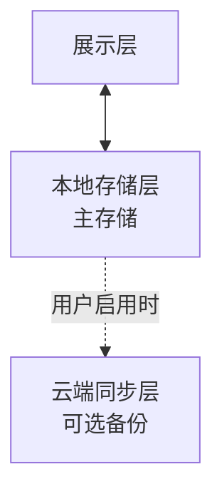
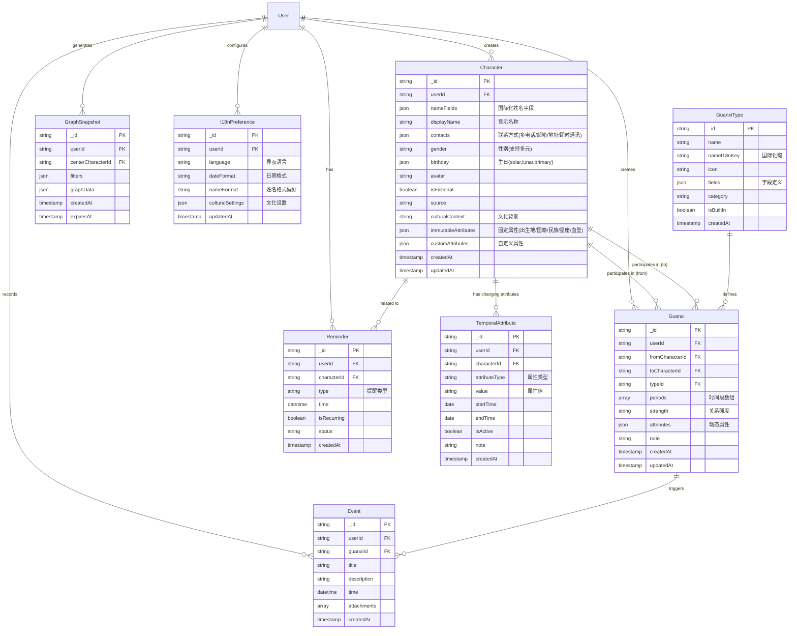
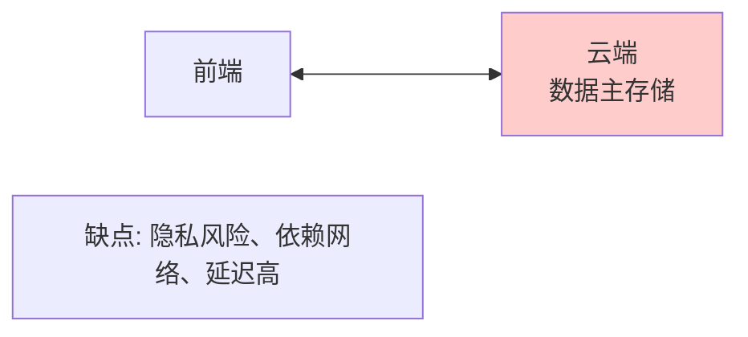
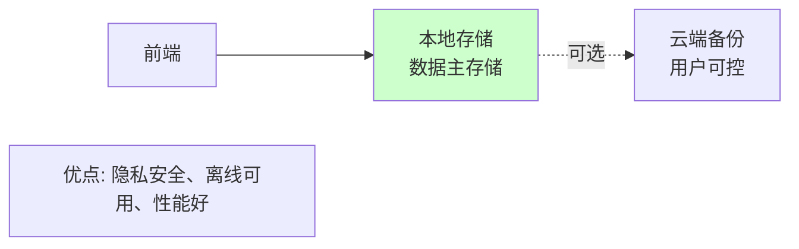

# 关系网 - 技术概要设计文档

## 文档说明

本文档为"关系网"小程序的**技术概要设计文档**，描述系统整体架构、技术选型、模块划分等宏观设计。

### 文档定位

- **面向**：架构师、项目经理、技术决策者、开发工程师
- **内容**：整体架构图、技术选型理由、模块职责、设计理念、关键设计决策与权衡
- **层次**：概念层、架构层，不涉及具体实现代码

### 文档目的

本文档旨在描述"关系网"小程序的技术架构设计，包括：
- 系统整体架构设计
- 核心技术选型及理由
- 模块划分与职责定义
- 关键设计决策与权衡
- 架构特点与设计理念

### 读者对象

- **项目架构师**：理解整体技术架构
- **技术决策者**：评估技术方案可行性
- **项目经理**：了解技术实现路线
- **开发工程师**：理解系统设计理念

### 配套文档

- [《关系网 - 业务需求》](./业务需求.md)：业务需求和用户场景
- [《关系网 - 技术详细设计》](./技术详细设计.md)：具体实现方案、算法设计、代码示例
- [《关系网 - 开发规范与标准》](./开发规范与标准.md)：编码规范、验收标准

### 参考文档

- [微信小程序开发文档](https://developers.weixin.qq.com/miniprogram/dev/framework/)
- [微信云开发文档](https://developers.weixin.qq.com/miniprogram/dev/wxcloud/basis/getting-started.html)

### 核心设计理念

本系统的**第一个核心设计理念**是**支持以任意人物为中心构建和查看关系网**，而不仅限于当前用户。这意味着：
- 人物是独立的实体，不与当前用户强绑定
- 关系图谱可以以任何人物为中心生成
- 支持虚构人物和真实人物的混合管理
- 适用于个人关系管理、小说分析、历史研究等多种场景

**第二个核心设计理念**是**本地存储优先，隐私保护至上**：
- 人际关系数据属于高度敏感信息
- 默认仅本地存储，不上传云端
- 通过加密导出/导入实现数据迁移
- 云同步完全可选，用户完全控制

---

## 目录

- [1. 系统架构设计](#1.-系统架构设计)
  - [1.1 整体架构](#1.1-整体架构)
  - [1.2 技术选型](#1.2-技术选型)
    - [1.2.1 前端技术栈](#1.2.1-前端技术栈)
    - [1.2.2 后端技术栈（可选云同步）](#1.2.2-后端技术栈（可选云同步）)
    - [1.2.3 可选扩展技术](#1.2.3-可选扩展技术)
  - [1.3 架构特点](#1.3-架构特点)
    - [1.3.1 数据库驱动的关系类型系统](#1.3.1-数据库驱动的关系类型系统)
    - [1.3.2 多时间段管理](#1.3.2-多时间段管理)
    - [1.3.3 动态属性系统](#1.3.3-动态属性系统)
    - [1.3.4 任意中心人物的图谱系统](#1.3.4-任意中心人物的图谱系统)
    - [1.3.5 本地优先的数据存储策略](#1.3.5-本地优先的数据存储策略)
    - [1.3.6 加密导入导出系统](#1.3.6-加密导入导出系统)
    - [1.3.7 国际化支持](#1.3.7-国际化支持)
- [2. 数据库设计概要](#2.-数据库设计概要)
  - [2.1 实体关系设计（ER图）](#2.1-实体关系设计（er图）)
  - [2.2 集合（Collection）清单](#2.2-集合（collection）清单)
  - [2.3 数据模型特点](#2.3-数据模型特点)
    - [2.3.1 国际化设计原则](#2.3.1-国际化设计原则)
    - [2.3.2 本地优先的存储策略](#2.3.2-本地优先的存储策略)
    - [2.3.3 人物独立性](#2.3.3-人物独立性)
    - [2.3.4 反范式设计](#2.3.4-反范式设计)
    - [2.3.5 灵活Schema](#2.3.5-灵活schema)
    - [2.3.6 派生属性自动计算](#2.3.6-派生属性自动计算)
    - [2.3.7 图谱缓存设计](#2.3.7-图谱缓存设计)
    - [2.3.8 索引策略（IndexedDB）](#2.3.8-索引策略（indexeddb）)
    - [2.3.9 主键数据类型选型](#2.3.9-主键数据类型选型)
  - [2.4 数据库设计原则](#2.4-数据库设计原则)
    - [2.4.1 灵活的Schema设计](#2.4.1-灵活的schema设计)
    - [2.4.2 适度冗余](#2.4.2-适度冗余)
    - [2.4.3 索引优化](#2.4.3-索引优化)
    - [2.4.4 数据一致性](#2.4.4-数据一致性)
    - [2.4.5 派生属性管理](#2.4.5-派生属性管理)
- [3. 性能优化方案](#3.-性能优化方案)
  - [3.1 前端优化](#3.1-前端优化)
  - [3.2 本地存储优化](#3.2-本地存储优化)
  - [3.3 图谱渲染优化](#3.3-图谱渲染优化)
  - [3.4 加解密性能优化](#3.4-加解密性能优化)
  - [3.5 导入导出优化](#3.5-导入导出优化)
- [4. 可扩展性设计](#4.-可扩展性设计)
  - [4.1 水平扩展](#4.1-水平扩展)
  - [4.2 功能扩展](#4.2-功能扩展)
  - [4.3 数据迁移](#4.3-数据迁移)
- [5. 部署架构](#5.-部署架构)
  - [5.1 环境划分](#5.1-环境划分)
  - [5.2 CI/CD流程](#5.2-ci/cd流程)
  - [5.3 监控与日志](#5.3-监控与日志)
- [6. 技术风险与应对](#6.-技术风险与应对)
  - [6.1 数据安全风险](#6.1-数据安全风险)
  - [6.2 性能风险](#6.2-性能风险)
  - [6.3 兼容性风险](#6.3-兼容性风险)
  - [6.4 云服务依赖风险](#6.4-云服务依赖风险)
  - [6.5 图谱复杂度风险](#6.5-图谱复杂度风险)
- [7. 技术选型对比](#7.-技术选型对比)
  - [7.1 小程序框架对比](#7.1-小程序框架对比)
  - [7.2 后端方案对比](#7.2-后端方案对比)
  - [7.3 图可视化库对比](#7.3-图可视化库对比)
- [8. 开发规范](#8.-开发规范)
  - [8.1 代码规范](#8.1-代码规范)
  - [8.2 Git 规范](#8.2-git-规范)
  - [8.3 文档规范](#8.3-文档规范)
- [9. 附录](#9.-附录)
  - [9.1 核心设计决策](#9.1-核心设计决策)
  - [9.2 技术选型对比](#9.2-技术选型对比)
  - [9.3 相关技术文档](#9.3-相关技术文档)
  - [9.4 变更记录](#9.4-变更记录)

---

## 1. 系统架构设计

### 1.1 整体架构

采用**本地优先 + 可选云同步**的技术架构，基于隐私保护原则设计：

**展示层（小程序端）**：


**本地存储层（主存储 - 默认）**：


**云端同步层（可选备份 - 用户可控）**：


**层次关系**：



**架构说明**：
1. **本地存储优先**：所有数据默认存储在小程序本地，保障隐私
2. **可选云同步**：用户可选择性开启云端备份功能
3. **加密保护**：敏感数据在本地加密存储
4. **离线优先**：完全离线可用，不依赖网络连接
5. **数据导入导出**：通过加密压缩包实现数据迁移

### 1.2 技术选型

#### 1.2.1 前端技术栈
| 技术 | 说明 | 理由 |
|------|------|------|
| 微信小程序原生框架 | 基础开发框架 | 官方支持，稳定可靠 |
| WeUI / Vant Weapp | UI组件库 | 提升开发效率，统一视觉风格 |
| MobX / Pinia | 状态管理 | 管理复杂应用状态 |
| **IndexedDB** | **本地数据库** | **结构化数据存储，支持大容量** |
| **JSZip + CryptoJS** | **压缩和加密** | **实现加密导出/导入功能** |
| **wx-i18n / mini-i18n** | **国际化框架** | **支持多语言界面切换** |
| ECharts / AntV F6 | 数据可视化 | 实现关系图谱展示，支持动态切换中心 |
| Day.js | 日期处理 | 轻量级时间处理库，支持国际化 |

#### 1.2.2 后端技术栈（可选云同步）
| 技术 | 说明 | 理由 |
|------|------|------|
| 微信云开发（可选） | Serverless平台 | 用于可选的云端同步功能 |
| Node.js | 云函数运行环境 | 与前端技术栈统一 |
| 云数据库（MongoDB）| NoSQL数据库 | 灵活的schema，适合动态属性 |
| 云存储 | 对象存储 | 存储用户头像、图片等文件 |

**注意**：云端功能完全可选，用户可以不启用任何云端功能，完全本地使用。

#### 1.2.3 可选扩展技术
| 技术 | 说明 | 使用场景 |
|------|------|----------|
| Redis | 缓存服务 | 高频查询数据缓存、图谱快照 |
| ElasticSearch | 全文搜索 | 复杂人物搜索需求 |
| OSS | 对象存储 | 大规模文件存储 |

### 1.3 架构特点

#### 1.3.1 数据库驱动的关系类型系统

**设计理念**：
- 🔓 **开放定义**：任何人都可以定义新的关系类型
- 📊 **数据库驱动**：类型定义存储在数据库，动态加载
- 🤝 **社区共建**：类型定义可导入导出，促进共享
- 🎨 **即插即用**：添加类型后立即可用，无需修改代码

**核心机制**：
- **数据库为唯一来源**：所有类型定义存储在 `guanxi_types` 集合
- **动态加载**：前端和云函数运行时从数据库读取类型
- **即时生效**：更新类型定义后，刷新即可看到效果
- **前后端统一**：前端表单生成和后端验证使用同一份类型定义

**数据流向**：
```
本地 IndexedDB - guanxi_types 集合（主存储）
    ↓ 读取
前端小程序：
  - 动态生成表单、选择器、图谱样式
  - 验证属性、执行推导规则、触发事件（本地运行）
    ↓ 可选同步
云函数（可选）：
  - 仅在用户启用云同步时参与
  - 同步类型定义到云端备份
```

**类型来源**：
- 系统预装类型（首次安装时导入，可修改删除）
- 用户自定义类型
- 从社区导入的类型
- AI Agent 生成的类型

所有类型在技术上完全平等，使用相同的数据结构和集成方式。

> 📖 **详细规范**：关于关系类型的完整设计规范、字段定义、推导规则、开发流程等详细内容，请参阅[《关系类型设计规范》](./关系类型设计/关系类型设计规范.md)。

#### 1.3.2 多时间段管理
- **数据结构**：时间段数组（Array<{startTime, endTime}>）
- **设计原则**：
  - 支持开放式时间段（endTime 为 null 表示持续中）
  - 时间段不重叠校验
  - 按时间顺序排序

#### 1.3.3 动态属性系统
- **实现方案**：EAV 模型（Entity-Attribute-Value）变体
- **存储方式**：JSON 文档存储，支持嵌套对象
- **扩展性**：无需修改数据库schema，直接扩展属性字段

#### 1.3.4 任意中心人物的图谱系统
- **核心设计**：人物与关系分离，支持以任意人物为起点生成图谱
- **实现方式**：
  - 人物（Character）作为独立实体存储（本地IndexedDB）
  - 图谱生成时接收 centerCharacterId 参数
  - 使用 BFS 算法从中心人物向外扩展
  - 支持实时切换中心人物
- **缓存策略**：
  - 按 (userId, centerCharacterId, filters) 缓存图谱数据
  - 支持多个中心人物的图谱共存
  - 切换中心时直接从本地缓存读取

#### 1.3.5 本地优先的数据存储策略
- **核心原则**：数据默认仅存储在本地，保护用户隐私
- **存储层次**：
  - **主存储**：IndexedDB（结构化数据，容量大）
  - **配置存储**：LocalStorage（用户偏好、设置）
  - **文件系统**：导出/导入数据包
- **隐私保护**：
  - 数据完全掌握在用户手中
  - 无需担心云端泄露风险
  - 离线完全可用

#### 1.3.6 加密导入导出系统
- **设计理念**：通过加密压缩包实现安全的数据迁移
- **文件格式**：`.gx[version]` 扩展名，便于版本识别
  - gx = GuanXi（关系）的缩写
  - version = 数据格式版本号（0, 1, 2...）
  - 不兼容变更时递增版本号
- **核心特性**：
  - 用户可选择是否加密（私密数据加密，公开数据明文）
  - AES-256-GCM 加密算法
  - PBKDF2 密钥派生（10万次迭代）
  - 密码不存储在数据包中
- **版本兼容**：
  - 导入时自动识别文件版本
  - 支持旧版本数据自动迁移
  - 不支持的版本提示升级程序
- **应用场景**：
  - 更换设备：导出-迁移-导入
  - 数据备份：定期导出保存
  - 数据分享：公开关系网（虚构人物）可明文导出分享

#### 1.3.7 国际化支持
- **界面多语言**：
  - 支持简体中文、繁体中文、英语、日语等
  - 采用 i18n 框架（wx-i18n / mini-i18n）实现语言切换
  - 根据系统语言自动切换，用户可手动设置
  - 所有UI文本、提示、错误消息均支持多语言
- **人物属性国际化**：
  - **姓名格式**：
    - 中文格式：姓 + 名（如：张三）
    - 西方格式：FirstName + MiddleName + LastName（如：John Michael Smith）
    - 日语格式：姓 + 名（如：山田太郎）
    - 使用 nameFields JSON 对象存储，支持多格式共存
    - 自动生成 displayName 用于界面显示
  - **性别选项**：
    - 基础选项：男性（Male）/ 女性（Female）/ 其他（Other）/ 不愿透露（Prefer not to say）
    - 扩展选项：非二元性别（Non-binary）等，根据地区配置
    - 使用枚举值存储（male/female/other/non_binary/prefer_not_to_say）
  - **文化差异属性**：
    - 根据 culturalContext 字段标识人物文化背景
    - 提供对应文化的属性模板
    - 支持中国、美国、日本等不同文化的人物混合管理
- **日期时间国际化**：
  - 内部统一使用 ISO 8601 格式（UTC时间）存储
  - 支持多种显示格式（YYYY-MM-DD、MM/DD/YYYY、DD/MM/YYYY等）
  - 时区自动转换
  - 本地化节假日和纪念日提醒
- **文化模板系统**：
  - 预置不同文化区域的属性模板
  - 包含姓名结构、性别选项、日期格式、字段配置等
  - 支持动态扩展新的文化模板

---

## 2. 数据库设计概要

### 2.1 实体关系设计（ER图）



### 2.2 集合（Collection）清单

| 集合名 | 说明 | 关键字段 |
|--------|------|----------|
| users | 用户信息 | _id, openid, nickName, avatarUrl, language |
| characters | 人物信息 | _id, userId, nameFields, displayName, gender, birthday, contacts, immutableAttributes, culturalContext |
| character_temporal_attributes | 人物可变属性 | _id, characterId, attributeType, value, startTime, endTime, isActive |
| guanxi | 关系信息 | _id, userId, fromCharacterId, toCharacterId, typeId, periods |
| guanxi_types | 关系类型定义 | _id, name, nameI18nKey, icon, fields, category |
| reminders | 提醒事项 | _id, userId, characterId, type, time |
| events | 事件时间线 | _id, userId, guanxiId, title, time |
| graph_snapshots | 图谱快照缓存 | _id, userId, centerCharacterId, filters, graphData |
| i18n_preferences | 国际化偏好 | _id, userId, language, dateFormat, nameFormat |

### 2.3 数据模型特点

#### 2.3.1 国际化设计原则
- **界面语言分离**：UI文本与代码分离，支持动态切换
- **数据国际化**：
  - 人物姓名：使用 nameFields JSON 对象存储多格式姓名
  - 性别选项：支持多元性别认同
  - 文化背景：记录人物所属文化区域，提供对应属性模板
- **日期时间**：统一使用 ISO 8601 格式存储，展示时根据用户偏好本地化
- **预置内容**：关系类型名称、系统提示等预置内容支持多语言

#### 2.3.2 本地优先的存储策略
- **主存储**：IndexedDB 本地数据库
- **配置存储**：Local Storage
- **数据分区**：
  - 私密数据：本地加密存储
  - 公开数据：可选择同步到云端
- **离线可用**：完全不依赖网络连接

#### 2.3.3 人物独立性
- 人物（Character）作为独立实体存储
- 不与"用户本人"强绑定
- 支持虚构人物标识（isFictional, source）
- 每个人物可独立作为关系网中心
- 支持不同文化背景的人物（culturalContext）

#### 2.3.4 反范式设计
- 适度冗余提升查询性能
- 在 guanxi 中冗余人物基本信息（显示名称、头像）

#### 2.3.5 灵活Schema
- 使用 IndexedDB 对象存储
- nameFields、attributes 等字段存储 JSON 对象
- 支持嵌套文档和数组

#### 2.3.6 派生属性自动计算
- **生日推算**：阳历 ⇄ 阴历自动转换
- **星座推算**：根据阳历生日自动计算星座（12星座）
- **生肖推算**：根据农历年份自动计算生肖（12生肖）
- **实现原则**：
  - 用户只需输入一种生日格式
  - 系统自动计算另一种格式及星座、生肖
  - 减少用户输入负担，避免输入错误
  - 计算结果存入 immutableAttributes 固定属性

#### 2.3.7 图谱缓存设计
- 本地缓存按 (centerCharacterId, filters) 缓存
- 支持多个中心人物的图谱数据同时存在
- 定期清理过期缓存

#### 2.3.8 索引策略（IndexedDB）
- 主键：自增ID（详见 2.3.9）
- 索引字段：displayName, phone, isFictional, source, culturalContext
- 复合索引：用于常用查询组合（如：userId + isFictional）

#### 2.3.9 主键数据类型选型

**技术背景**：
- IndexedDB 支持的主键类型：Number（可自增）、String（包括UUID）、Date、Array
- UUID 字符串示例：`"550e8400-e29b-41d4-a716-446655440000"`（36字节）

**选型对比**：

| 主键策略 | 优点 | 缺点 | 适用场景 |
|---------|------|------|---------|
| **自增 Number**<br/>（本项目采用） | • 查询性能最优<br/>• 空间占用最小（4-8字节）<br/>• 实现简单无依赖<br/>• 索引效率高 | • 多设备离线编辑易冲突<br/>• 同步需云端协调 | ✅ 单设备使用为主<br/>✅ 云端协调同步<br/>✅ 本地存储优先 |
| **UUID String** | • 全局唯一标识<br/>• 分布式友好<br/>• 离线生成安全<br/>• 无需中央协调 | • 字符串索引性能略低<br/>• 占用空间较大（36字节）<br/>• 需引入UUID生成库 | ✅ 多设备离线协作<br/>✅ P2P 同步<br/>✅ 去中心化架构 |

**安全性分析**：

传统云存储架构中，自增ID存在"拖库"风险（攻击者遍历ID获取数据）。但**本项目采用本地存储优先架构，从根本上避免了这个风险**：

```
【云存储架构 - 有拖库风险】
攻击者 → 遍历ID (1,2,3...) → 云端API → 获取所有用户数据 ❌

【本地存储架构 - 无拖库风险】
攻击者 → 尝试访问 → 用户设备本地IndexedDB → 物理隔离，无法访问 ✅
```

**三层安全防护**：

1. **本地存储（主防护）**：
   - 数据存储在用户设备的 IndexedDB
   - 攻击者无法通过网络远程访问
   - 物理隔离 = 最强防护

2. **云同步访问控制（可选功能）**：
   ```javascript
   // 云数据库权限设置
   {
     "read": "doc._openid == auth.openid",   // 只能读自己的数据
     "write": "doc._openid == auth.openid"   // 只能写自己的数据
   }
   ```
   - 每个用户只能访问自己 `_openid` 的数据
   - 无法跨用户拖库

3. **加密导出**：
   - AES-256 加密
   - 密码不存储
   - 文件泄露也无法解密

**设计决策**：

**采用自增 Number 作为主键**，理由：

1. ✅ **符合架构定位**：本地存储优先架构，自增ID性能最优
2. ✅ **安全性充分**：多层防护体系，无拖库风险
3. ✅ **已有同步方案**：通过 `cloudId` 字段映射云端 ObjectId
4. ✅ **实现简单**：无需引入额外的 UUID 生成库

**何时考虑 UUID**：

只有当架构变更为以下场景时才需要重新评估：
- 改为云数据库主存储（不推荐，违背隐私保护原则）
- 需要完全去中心化的多设备离线协作（P2P同步）
- 需要提供公开的 REST API 服务

在当前"本地存储优先 + 可选云同步"的架构下，自增 ID 是最佳选择。

### 2.4 数据库设计原则

#### 2.4.1 灵活的Schema设计
- 使用 `attributes` 字段存储动态属性，支持不同关系类型的差异化需求
- 使用 JSON 文档的嵌套能力，避免过多关联查询
- 支持扩展：新增字段不影响现有数据

#### 2.4.2 适度冗余
- **原则**：在查询性能和数据一致性之间取得平衡
- **冗余策略**：
  - 在 guanxi 中冗余人物的显示名称和头像，减少关联查询
  - 在 characters 中冗余统计信息（关系数量），提升列表查询性能
  - 在 events 中冗余人物名称，加快时间线展示
- **一致性保证**：
  - 更新源数据时，同步更新冗余数据
  - 定期数据校验任务检查并修复不一致

#### 2.4.3 索引优化
- **原则**：为高频查询字段建立索引，但避免过度索引
- **索引策略**：
  - 单字段索引：userId, name, phone, email 等常用查询字段
  - 复合索引：优化多条件查询（如：userId + name, userId + isFictional）
  - 文本索引：支持人物姓名、描述等字段的全文搜索
  - 时间索引：支持按时间范围查询事件和提醒
- **索引维护**：定期分析查询性能，动态调整索引

#### 2.4.4 数据一致性
- **事务保证**：使用云函数或本地事务保证关键操作的原子性
- **乐观锁**：关键操作（如删除人物、修改关系）使用版本号防止并发冲突
- **级联操作**：
  - 删除人物时，检查是否有关联关系
  - 提供强制删除选项（级联删除所有关系）
- **数据校验**：定期校验任务检查数据完整性和一致性

#### 2.4.5 派生属性管理
- **自动计算**：生日 → 星座/生肖，阴历 ⇄ 阳历
- **计算时机**：创建、修改人物时自动触发
- **存储策略**：计算结果存入数据库，避免重复计算
- **更新策略**：源属性变化时，自动重新计算派生属性

---

## 3. 性能优化方案

### 3.1 前端优化
- **按需加载**：页面和组件懒加载
- **列表优化**：虚拟列表，只渲染可视区域
- **图片优化**：图片压缩、懒加载、本地缓存
- **代码分包**：小程序分包加载
- **本地缓存**：IndexedDB持久化，无需网络请求
- **Web Worker**：加解密操作在Worker中执行，不阻塞UI

### 3.2 本地存储优化
- **IndexedDB索引**：为高频查询字段建索引
- **批量操作**：合并多次数据库操作，使用事务
- **数据压缩**：大文本字段压缩存储
- **定期清理**：清理过期缓存和临时数据
- **分页加载**：大列表分页加载，避免一次性加载全部

### 3.3 图谱渲染优化
- **节点限制**：最多渲染200个节点
- **LOD（层次细节）**：远距离节点简化渲染
- **Canvas渲染**：使用Canvas而非DOM
- **增量更新**：切换中心时只更新变化部分
- **本地缓存**：图谱数据本地缓存，快速切换

### 3.4 加解密性能优化
- **Web Worker**：加解密在后台线程执行
- **分块处理**：大文件分块加解密，显示进度
- **缓存密钥**：会话期间缓存派生的密钥
- **压缩优先**：先压缩后加密，减小数据量

### 3.5 导入导出优化
- **流式处理**：大文件流式读写
- **增量导入**：支持部分导入，不必全部导入
- **后台任务**：长时间操作在后台进行
- **进度反馈**：实时显示进度，提升体验

## 4. 可扩展性设计

### 4.1 水平扩展
- 云函数自动伸缩
- 数据库读写分离（主从复制）
- CDN 静态资源分发
- 图谱计算任务队列

### 4.2 功能扩展
- **开放类型系统**：任何人都可以定义、修改、分享关系类型（详见[《关系类型设计规范》](./关系类型设计/关系类型设计规范.md)）
- **Hook机制**：关键流程预留扩展点
- **配置化**：界面和业务规则配置化
- **多项目管理**：未来可支持多个独立的关系网项目

### 4.3 数据迁移
- 版本化数据模型
- 数据迁移脚本
- 向后兼容策略

## 5. 部署架构

### 5.1 环境划分
- **开发环境**：本地开发测试
- **测试环境**：云开发测试环境
- **生产环境**：云开发正式环境

### 5.2 CI/CD流程


### 5.3 监控与日志
- **性能监控**：小程序性能监控，关注图谱生成时间
- **错误监控**：云开发错误日志
- **业务监控**：关键指标（用户数、人物数、关系数、中心切换次数等）
- **日志系统**：结构化日志，便于查询分析

## 6. 技术风险与应对

### 6.1 数据安全风险
**风险**：用户隐私数据泄露

**应对**：
- 数据加密存储
- 严格的权限控制
- 定期安全审计

### 6.2 性能风险
**风险**：大量数据导致性能下降，特别是复杂图谱

**应对**：
- 分页加载
- 数据归档
- 缓存优化
- 节点数量限制
- 图谱简化算法

### 6.3 兼容性风险
**风险**：不同微信版本、机型兼容性问题

**应对**：
- 充分测试覆盖
- 渐进式增强
- 降级方案

### 6.4 云服务依赖风险
**风险**：微信云开发服务不稳定

**应对**：
- 多云备份方案
- 关键数据本地缓存
- 降级方案

### 6.5 图谱复杂度风险
**风险**：关系网过于复杂导致渲染卡顿

**应对**：
- 深度限制（默认3层）
- 节点数量限制（最多200个）
- 分层渲染
- 用户可调整参数

## 7. 技术选型对比

### 7.1 小程序框架对比
| 框架 | 优点 | 缺点 | 选择 |
|------|------|------|------|
| 原生小程序 | 性能最优，官方支持 | 开发效率较低 | ✅ 选择 |
| uni-app | 跨平台，开发效率高 | 性能略差，包体积大 | - |
| Taro | React语法，生态好 | 学习成本，兼容性问题 | - |

**选择理由**：本项目需要复杂的图形渲染，原生开发性能和稳定性最佳。

### 7.2 后端方案对比
| 方案 | 优点 | 缺点 | 选择 |
|------|------|------|------|
| 云开发 | 快速开发，低成本 | 功能受限，厂商锁定 | ✅ 选择 |
| 自建服务器 | 灵活可控 | 开发成本高，运维复杂 | - |
| 第三方BaaS | 功能丰富 | 费用高，依赖第三方 | - |

**选择理由**：MVP阶段快速开发，云开发成本低，后期可迁移。

### 7.3 图可视化库对比
| 库 | 优点 | 缺点 | 选择 |
|------|------|------|------|
| AntV F6 | 功能强大，小程序支持好 | 学习曲线 | ✅ 选择 |
| ECharts Graph | 简单易用 | 自定义能力弱 | 备选 |
| D3.js | 灵活强大 | 小程序支持差 | - |

**选择理由**：F6 专为图可视化设计，支持小程序，适合本项目需求。

## 8. 开发规范

### 8.1 代码规范
- 遵循 ESLint + Prettier
- 使用 TypeScript 类型检查
- 统一命名规范（驼峰、短横线）
- 术语统一：使用 character（人物）而非 contact，使用 guanxi 而非 relation

### 8.2 Git 规范
- 分支管理：main / develop / feature/*
- Commit 规范：`type(scope): message`
- Code Review 机制

### 8.3 文档规范
- 接口文档：使用 JSDoc
- API 文档：使用 Swagger
- 变更日志：CHANGELOG.md

## 9. 附录

### 9.1 核心设计决策

#### 为什么使用"人物"
- 涵盖真实和虚构角色
- 支持多种应用场景
- 可以从任意人物出发

#### 为什么使用"Guanxi"
- 中文"关系"含义丰富
- 国际学术界已接受

#### 为什么支持任意人物为中心
- 不局限于"我"的关系网
- 支持多视角分析
- 应用场景：个人管理、小说分析、历史研究等

#### **为什么本地存储优先（核心决策）**

**隐私考虑**：
- 人际关系数据是最敏感的个人信息之一
- 包含联系方式、关系强度、私密备注等
- 用户不愿意将此类数据存储在云端
- 数据泄露风险不可接受

**技术优势**：
- **性能**：本地读写速度远快于网络请求
- **离线**：完全离线可用，不依赖网络
- **隐私**：数据完全掌握在用户手中
- **成本**：无服务器成本，无流量费用

**用户体验**：
- 无需注册登录即可使用
- 无需担心隐私泄露
- 应用响应速度更快
- 完全离线可用

**架构设计**：

**传统架构**：


**本地优先架构**：


#### **为什么使用加密导出/导入（核心决策）**

**问题场景**：
- 用户需要更换设备
- 用户需要备份数据
- 用户希望在多设备间迁移数据
- 但不愿意使用云同步（隐私顾虑）

**传统方案的问题**：
- 明文导出：数据泄露风险高
- 云同步：用户不信任云端
- 账号系统：增加使用门槛

**加密导出方案的优势**：
- **安全**：AES-256加密，密码不存储
- **灵活**：用户可选择是否加密
- **便捷**：一个文件解决数据迁移
- **通用**：ZIP格式兼容性好

**设计权衡**：
- 放弃：便捷的云同步体验
- 获得：完全的隐私保护和数据主权
- 原则：隐私保护优先于便捷性

#### **公开数据与私密数据的区分**

**设计思路**：
- 虚构人物关系（如《红楼梦》）：可以公开分享
- 真实人际关系：必须保护隐私
- 用户在导出时选择：
  - 设置密码 → 私密数据
  - 不设置密码 → 公开数据

**应用场景**：
- 文学爱好者整理小说人物关系，分享给他人
- 历史研究者整理历史人物关系，发布在论坛
- 个人人际关系，仅自己备份使用

### 9.2 技术选型对比

#### 9.2.1 存储方案对比

| 方案 | 优点 | 缺点 | 选择 |
|------|------|------|------|
| **本地存储（IndexedDB）** | **隐私安全、离线可用、性能好、无成本** | 不同设备需手动迁移 | ✅ **主存储** |
| 云数据库（主存储） | 多设备同步方便 | 隐私风险、依赖网络、有成本 | ❌ |
| 云数据库（可选备份） | 作为备份手段 | 需要用户信任 | ✅ 可选 |
| LocalStorage | 简单 | 容量小（5-10MB） | ✅ 辅助 |

#### 9.2.2 加密方案对比

| 方案 | 优点 | 缺点 | 选择 |
|------|------|------|------|
| **加密ZIP** | **标准格式、兼容性好、压缩+加密** | 需要手动解密 | ✅ 选择 |
| 自定义加密格式 | 可控性强 | 兼容性差、维护成本高 | ❌ |
| 云端加密存储 | 自动同步 | 用户不信任、增加依赖 | ❌ |

### 9.3 相关技术文档
- [微信小程序开发文档](https://developers.weixin.qq.com/miniprogram/dev/framework/)
- [微信云开发文档](https://developers.weixin.qq.com/miniprogram/dev/wxcloud/basis/getting-started.html)
- [AntV F6 图可视化](https://f6.antv.vision/)

### 9.4 变更记录
| 版本 | 日期 | 修改内容 | 修改人 |
|------|------|----------|--------|
| 1.0 | 2026-03-22 | 初始版本 | - |
| 1.1 | 2026-03-22 | 新增 §2.3.9 主键数据类型选型章节，详细说明自增ID vs UUID的技术选型考量和安全性分析 | - |
| 1.2 | 2026-03-22 | 文档结构调整：将第1章"文档说明"内容合并到前言，所有后续章节序号递减1。更新目录和章节交叉引用 | - |
