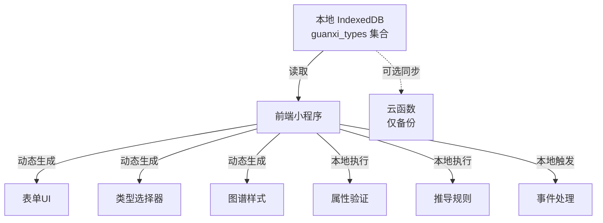

# 关系网 - 技术详细设计文档

## 导航
- **上一章**: [4. 前端页面设计](./技术详细设计-4-前端页面设计.md)
- **返回目录**: [目录](./技术详细设计.md)
- **下一章**: [6. 测试设计](./技术详细设计-6-测试设计.md)

---

## 5. 关系类型插件实现

### 5.1 架构说明

**数据库驱动的类型系统**：

关系类型定义存储在 `guanxi_types` 数据库集合中，系统运行时动态读取和使用。这种设计带来以下优势：

- ✅ **即插即用**：添加类型后立即可用，无需修改代码
- ✅ **在线编辑**：可通过管理界面直接修改类型定义
- ✅ **社区共建**：类型定义可导入导出，促进共享
- ✅ **前后端统一**：前端和云函数从同一数据源读取

**工作流程**：



**说明**：
- 所有核心逻辑（验证、推导、事件）在前端本地执行
- 云函数仅在用户启用云同步时作为备份参与
- 确保离线完全可用

### 5.2 基类定义（可选的辅助工具）

虽然类型定义直接以JSON存储在数据库中，但可以提供 BaseGuanxiType 类作为开发辅助工具，帮助生成和验证类型定义：

```javascript
// types/base.type.js
class BaseGuanxiType {
  constructor(config) {
    this.id = config.id;
    this.name = config.name;
    this.nameEn = config.nameEn;
    this.icon = config.icon;
    this.color = config.color;
    this.category = config.category;
    this.description = config.description;
    this.fields = config.fields || [];
    this.config = Object.assign({
      supportMultiPeriod: true,
      requirePeriod: false,
      bidirectional: true,
      showInGraph: true,
      priority: 0
    }, config.config || {});
  }

  /**
   * 获取字段定义
   */
  getFields() {
    return this.fields;
  }

  /**
   * 验证属性
   */
  validate(attributes) {
    const errors = [];

    for (const field of this.fields) {
      const value = attributes[field.name];

      // 必填验证
      if (field.required && !value) {
        errors.push(`${field.label}不能为空`);
        continue;
      }

      // 类型验证
      if (value !== undefined && value !== null) {
        if (!this.validateFieldType(field, value)) {
          errors.push(`${field.label}格式不正确`);
        }
      }

      // 自定义验证
      if (field.validation && value) {
        const validationError = this.validateField(field, value);
        if (validationError) {
          errors.push(validationError);
        }
      }
    }

    return {
      valid: errors.length === 0,
      errors
    };
  }

  /**
   * 类型验证
   */
  validateFieldType(field, value) {
    switch (field.type) {
      case 'string':
        return typeof value === 'string';
      case 'number':
        return typeof value === 'number';
      case 'date':
        return /^\d{4}-\d{2}-\d{2}$/.test(value);
      case 'select':
        return field.options.includes(value);
      case 'multiSelect':
        return Array.isArray(value) && value.every(v => field.options.includes(v));
      case 'boolean':
        return typeof value === 'boolean';
      default:
        return true;
    }
  }

  /**
   * 字段验证
   */
  validateField(field, value) {
    const { validation } = field;

    if (validation.pattern) {
      const regex = new RegExp(validation.pattern);
      if (!regex.test(value)) {
        return validation.message || `${field.label}格式不正确`;
      }
    }

    if (validation.min !== undefined && value < validation.min) {
      return `${field.label}不能小于${validation.min}`;
    }

    if (validation.max !== undefined && value > validation.max) {
      return `${field.label}不能大于${validation.max}`;
    }

    return null;
  }

  /**
   * 获取表单配置
   */
  getFormConfig() {
    return {
      id: this.id,
      name: this.name,
      fields: this.fields.map(field => ({
        ...field,
        component: this.getFieldComponent(field.type)
      }))
    };
  }

  /**
   * 获取字段组件类型
   */
  getFieldComponent(type) {
    const componentMap = {
      string: 'input',
      number: 'number-input',
      date: 'date-picker',
      select: 'select',
      multiSelect: 'checkbox-group',
      boolean: 'switch'
    };
    return componentMap[type] || 'input';
  }

  /**
   * 获取展示配置
   */
  getDisplayConfig() {
    return {
      icon: this.icon,
      color: this.color,
      priority: this.config.priority
    };
  }

  /**
   * 转换为数据库格式
   */
  toDBFormat() {
    return {
      _id: this.id,
      name: this.name,
      nameEn: this.nameEn,
      icon: this.icon,
      color: this.color,
      category: this.category,
      description: this.description,
      fields: this.fields,
      config: this.config,
      version: '1.0.0',
      isEnabled: true,
      createdAt: new Date(),
      updatedAt: new Date()
    };
  }
}

module.exports = BaseGuanxiType;
```

> **注意**：BaseGuanxiType 只是辅助工具类，用于生成符合规范的类型定义。真正的类型定义存储在数据库中，系统运行时不依赖这些类文件。

### 5.3 系统预装类型示例

```javascript
// types/relative.type.js
const BaseGuanxiType = require('./base.type');

class RelativeType extends BaseGuanxiType {
  constructor() {
    super({
      id: 'relative',
      name: '亲戚关系',
      nameEn: 'Relative',
      icon: 'family',
      color: '#FF6B6B',
      category: 'family',
      description: '血缘或姻亲关系',
      fields: [
        {
          name: 'title',
          label: '称谓',
          labelEn: 'Title',
          type: 'string',
          required: true,
          placeholder: '如：父亲、母亲、伯父、表姐等',
          displayOrder: 1
        },
        {
          name: 'lineage',
          label: '血缘关系',
          labelEn: 'Lineage',
          type: 'select',
          required: false,
          options: ['直系', '旁系', '姻亲'],
          defaultValue: '直系',
          displayOrder: 2
        },
        {
          name: 'generation',
          label: '辈分',
          labelEn: 'Generation',
          type: 'select',
          required: false,
          options: ['长辈', '平辈', '晚辈'],
          defaultValue: '平辈',
          displayOrder: 3
        },
        {
          name: 'familyAddress',
          label: '家庭地址',
          labelEn: 'Family Address',
          type: 'string',
          required: false,
          placeholder: '详细地址',
          displayOrder: 4
        },
        {
          name: 'anniversaries',
          label: '重要纪念日',
          labelEn: 'Anniversaries',
          type: 'string',
          required: false,
          placeholder: '如：结婚纪念日等',
          displayOrder: 5
        }
      ],
      config: {
        supportMultiPeriod: false,  // 亲戚关系通常不会中断
        requirePeriod: false,
        bidirectional: false,       // 称谓通常是单向的
        showInGraph: true,
        priority: 10
      }
    });
  }
}

module.exports = RelativeType;
```

### 5.3 系统预装类型示例

#### 5.3.1 亲戚关系类型

```javascript
// types/friend.type.js
const BaseGuanxiType = require('./base.type');

class FriendType extends BaseGuanxiType {
  constructor() {
    super({
      id: 'friend',
      name: '好友关系',
      nameEn: 'Friend',
      icon: 'people',
      color: '#4ECDC4',
      category: 'social',
      description: '朋友关系',
      fields: [
        {
          name: 'metAt',
          label: '认识场合',
          labelEn: 'Met At',
          type: 'string',
          required: false,
          placeholder: '如：学校、工作、社群等',
          displayOrder: 1
        },
        {
          name: 'commonHobbies',
          label: '共同爱好',
          labelEn: 'Common Hobbies',
          type: 'multiSelect',
          required: false,
          options: ['运动', '游戏', '音乐', '电影', '旅游', '美食', '阅读', '摄影'],
          displayOrder: 2
        },
        {
          name: 'friendLevel',
          label: '友谊等级',
          labelEn: 'Friend Level',
          type: 'select',
          required: false,
          options: ['普通朋友', '好友', '闺蜜/兄弟', '发小'],
          defaultValue: '好友',
          displayOrder: 3
        },
        {
          name: 'lastContactTime',
          label: '最后联系时间',
          labelEn: 'Last Contact',
          type: 'date',
          required: false,
          displayOrder: 4
        },
        {
          name: 'contactFrequency',
          label: '联系频率',
          labelEn: 'Contact Frequency',
          type: 'select',
          required: false,
          options: ['经常', '偶尔', '很少'],
          defaultValue: '偶尔',
          displayOrder: 5
        }
      ],
      config: {
        supportMultiPeriod: true,   // 好友关系可能断联和重联
        requirePeriod: false,
        bidirectional: true,
        showInGraph: true,
        priority: 8
      }
    });
  }
}

module.exports = FriendType;
```

#### 5.3.2 好友关系类型

```javascript
// types/colleague.type.js
const BaseGuanxiType = require('./base.type');

class ColleagueType extends BaseGuanxiType {
  constructor() {
    super({
      id: 'colleague',
      name: '同事关系',
      nameEn: 'Colleague',
      icon: 'briefcase',
      color: '#FFD93D',
      category: 'work',
      description: '工作同事关系',
      fields: [
        {
          name: 'company',
          label: '公司名称',
          labelEn: 'Company',
          type: 'string',
          required: true,
          placeholder: '公司全称',
          displayOrder: 1
        },
        {
          name: 'department',
          label: '部门',
          labelEn: 'Department',
          type: 'string',
          required: false,
          placeholder: '部门名称',
          displayOrder: 2
        },
        {
          name: 'position',
          label: '职位',
          labelEn: 'Position',
          type: 'string',
          required: false,
          placeholder: '职位名称',
          displayOrder: 3
        },
        {
          name: 'workRelation',
          label: '工作关系',
          labelEn: 'Work Relation',
          type: 'select',
          required: false,
          options: ['上级', '下级', '平级', '跨部门'],
          defaultValue: '平级',
          displayOrder: 4
        },
        {
          name: 'projects',
          label: '合作项目',
          labelEn: 'Projects',
          type: 'string',
          required: false,
          placeholder: '共同参与的项目',
          displayOrder: 5
        },
        {
          name: 'officeLocation',
          label: '办公地点',
          labelEn: 'Office Location',
          type: 'string',
          required: false,
          placeholder: '办公地址',
          displayOrder: 6
        }
      ],
      config: {
        supportMultiPeriod: true,   // 同事关系会因离职而中断
        requirePeriod: true,        // 同事关系必须有时间段
        bidirectional: true,
        showInGraph: true,
        priority: 7
      }
    });
  }
}

module.exports = ColleagueType;
```

#### 5.3.3 同事关系类型

```javascript
// types/classmate.type.js
const BaseGuanxiType = require('./base.type');

class ClassmateType extends BaseGuanxiType {
  constructor() {
    super({
      id: 'classmate',
      name: '同学关系',
      nameEn: 'Classmate',
      icon: 'school',
      color: '#6BCB77',
      category: 'education',
      description: '同学关系',
      fields: [
        {
          name: 'school',
          label: '学校名称',
          labelEn: 'School',
          type: 'string',
          required: true,
          placeholder: '学校全称',
          displayOrder: 1
        },
        {
          name: 'major',
          label: '专业',
          labelEn: 'Major',
          type: 'string',
          required: false,
          placeholder: '专业名称',
          displayOrder: 2
        },
        {
          name: 'classInfo',
          label: '班级',
          labelEn: 'Class',
          type: 'string',
          required: false,
          placeholder: '如：2010级1班',
          displayOrder: 3
        },
        {
          name: 'enrollmentYear',
          label: '入学年份',
          labelEn: 'Enrollment Year',
          type: 'number',
          required: false,
          placeholder: '如：2010',
          validation: {
            min: 1950,
            max: 2050
          },
          displayOrder: 4
        },
        {
          name: 'graduationYear',
          label: '毕业年份',
          labelEn: 'Graduation Year',
          type: 'number',
          required: false,
          placeholder: '如：2014',
          validation: {
            min: 1950,
            max: 2050
          },
          displayOrder: 5
        },
        {
          name: 'educationLevel',
          label: '学历阶段',
          labelEn: 'Education Level',
          type: 'select',
          required: false,
          options: ['小学', '初中', '高中', '大学本科', '硕士研究生', '博士研究生'],
          displayOrder: 6
        },
        {
          name: 'isSameClass',
          label: '是否同班',
          labelEn: 'Same Class',
          type: 'boolean',
          required: false,
          defaultValue: true,
          displayOrder: 7
        },
        {
          name: 'isSameDorm',
          label: '是否同寝室',
          labelEn: 'Same Dorm',
          type: 'boolean',
          required: false,
          defaultValue: false,
          displayOrder: 8
        }
      ],
      config: {
        supportMultiPeriod: false,  // 同学关系有明确的时间段
        requirePeriod: true,
        bidirectional: true,
        showInGraph: true,
        priority: 6
      }
    });
  }
}

module.exports = ClassmateType;
```

#### 5.3.4 同学关系类型

```javascript
// types/neighbor.type.js
const BaseGuanxiType = require('./base.type');

class NeighborType extends BaseGuanxiType {
  constructor() {
    super({
      id: 'neighbor',
      name: '邻里关系',
      nameEn: 'Neighbor',
      icon: 'home',
      color: '#A8E6CF',
      category: 'neighbor',
      description: '邻居关系',
      fields: [
        {
          name: 'community',
          label: '小区名称',
          labelEn: 'Community',
          type: 'string',
          required: true,
          placeholder: '小区全称',
          displayOrder: 1
        },
        {
          name: 'address',
          label: '门牌号',
          labelEn: 'Address',
          type: 'string',
          required: false,
          placeholder: '如：1栋2单元302',
          displayOrder: 2
        },
        {
          name: 'neighborType',
          label: '邻居类型',
          labelEn: 'Neighbor Type',
          type: 'select',
          required: false,
          options: ['同楼层', '同单元', '同栋', '同小区'],
          defaultValue: '同楼层',
          displayOrder: 3
        },
        {
          name: 'proximity',
          label: '联系紧密度',
          labelEn: 'Proximity',
          type: 'select',
          required: false,
          options: ['经常来往', '偶尔碰面', '仅认识'],
          defaultValue: '偶尔碰面',
          displayOrder: 4
        }
      ],
      config: {
        supportMultiPeriod: true,   // 邻居关系会因搬家而中断
        requirePeriod: true,
        bidirectional: true,
        showInGraph: true,
        priority: 5
      }
    });
  }
}

module.exports = NeighborType;
```

#### 5.3.5 邻里关系类型

```javascript
// types/registry.js
const RelativeType = require('./relative.type');
const FriendType = require('./friend.type');
const ColleagueType = require('./colleague.type');
const ClassmateType = require('./classmate.type');
const NeighborType = require('./neighbor.type');

class GuanxiTypeRegistry {
  constructor() {
    this.types = new Map();
    this.initBuiltInTypes();
  }

  /**
   * 初始化内置类型
   */
  initBuiltInTypes() {
    const builtInTypes = [
      new RelativeType(),
      new FriendType(),
      new ColleagueType(),
      new ClassmateType(),
      new NeighborType()
    ];

    builtInTypes.forEach(type => {
      this.register(type);
    });
  }

  /**
   * 注册类型
   */
  register(type) {
    this.types.set(type.id, type);
  }

  /**
   * 获取类型
   */
  get(typeId) {
    return this.types.get(typeId);
  }

  /**
   * 获取所有类型
   */
  getAll() {
    return Array.from(this.types.values());
  }

  /**
   * 按分类获取类型
   */
  getByCategory(category) {
    return this.getAll().filter(type => type.category === category);
  }

  /**
   * 验证属性
   */
  validate(typeId, attributes) {
    const type = this.get(typeId);
    if (!type) {
      return {
        valid: false,
        errors: ['关系类型不存在']
      };
    }
    return type.validate(attributes);
  }

### 5.4 数据库初始化

系统首次启动时，将预装类型写入数据库：

```javascript
// utils/init-types.js

const RelativeType = require('../types/relative.type');
const FriendType = require('../types/friend.type');
const ColleagueType = require('../types/colleague.type');
const ClassmateType = require('../types/classmate.type');
const NeighborType = require('../types/neighbor.type');

/**
 * 初始化预装类型到数据库
 * 仅在首次安装或数据库为空时执行
 */
async function initPreloadedTypes(db) {
  // 检查是否已初始化
  const count = await db.collection('guanxi_types').count();
  if (count.total > 0) {
    console.log('类型已初始化，跳过');
    return;
  }

  // 创建预装类型实例
  const preloadedTypes = [
    new RelativeType(),
    new FriendType(),
    new ColleagueType(),
    new ClassmateType(),
    new NeighborType()
  ];

  // 批量写入数据库
  const promises = preloadedTypes.map(type => {
    return db.collection('guanxi_types').add({
      data: type.toDBFormat()
    });
  });

  await Promise.all(promises);
  console.log(`成功初始化 ${preloadedTypes.length} 个预装类型`);
}

module.exports = { initPreloadedTypes };
```

```javascript
// app.js - 应用启动时初始化
App({
  async onLaunch() {
    // 初始化云开发
    wx.cloud.init();

    const db = wx.cloud.database();

    // 初始化预装类型（仅首次）
    await initPreloadedTypes(db);

    // 之后所有类型都从数据库读取
  }
});
```

### 5.5 类型服务（Type Service）

提供统一的类型访问接口，封装数据库操作：

```javascript
// services/type.service.js

class TypeService {
  constructor(db) {
    this.db = db;
    this.cache = new Map();  // 本地缓存
    this.cacheExpiry = 5 * 60 * 1000;  // 5分钟过期
  }

  /**
   * 获取所有启用的类型
   */
  async getAllTypes() {
    const result = await this.db.collection('guanxi_types')
      .where({ isEnabled: true })
      .orderBy('priority', 'desc')
      .get();

    return result.data;
  }

  /**
   * 获取单个类型（带缓存）
   */
  async getType(typeId) {
    // 检查缓存
    if (this.cache.has(typeId)) {
      const cached = this.cache.get(typeId);
      if (Date.now() - cached.timestamp < this.cacheExpiry) {
        return cached.data;
      }
    }

    // 从数据库读取
    const result = await this.db.collection('guanxi_types')
      .doc(typeId)
      .get();

    if (result.data) {
      // 更新缓存
      this.cache.set(typeId, {
        data: result.data,
        timestamp: Date.now()
      });
    }

    return result.data;
  }

  /**
   * 按分类获取类型
   */
  async getTypesByCategory(category) {
    const result = await this.db.collection('guanxi_types')
      .where({
        category: category,
        isEnabled: true
      })
      .get();

    return result.data;
  }

  /**
   * 验证属性
   */
  async validateAttributes(typeId, attributes) {
    const type = await this.getType(typeId);

    if (!type) {
      return {
        valid: false,
        errors: ['关系类型不存在']
      };
    }

    return this.validate(type.fields, attributes);
  }

  /**
   * 字段验证逻辑
   */
  validate(fields, attributes) {
    const errors = [];

    for (const field of fields) {
      const value = attributes[field.name];

      // 必填验证
      if (field.required && !value) {
        errors.push(`${field.label}不能为空`);
        continue;
      }

      // 类型验证和自定义验证
      // ... (见 5.2 BaseGuanxiType 实现)
    }

    return {
      valid: errors.length === 0,
      errors
    };
  }

  /**
   * 清除缓存
   */
  clearCache(typeId) {
    if (typeId) {
      this.cache.delete(typeId);
    } else {
      this.cache.clear();
    }
  }
}

module.exports = TypeService;
```

### 5.6 前端集成示例

#### 5.6.1 类型选择器组件

```javascript
// components/type-selector/index.js

Component({
  data: {
    types: [],
    selectedTypeId: ''
  },

  lifetimes: {
    async attached() {
      await this.loadTypes();
    }
  },

  methods: {
    /**
     * 从数据库加载类型（唯一来源）
     */
    async loadTypes() {
      const db = wx.cloud.database();
      const result = await db.collection('guanxi_types')
        .where({ isEnabled: true })
        .orderBy('priority', 'desc')
        .field({
          _id: true,
          name: true,
          icon: true,
          color: true,
          category: true
        })
        .get();

      this.setData({
        types: result.data
      });
    },

    /**
     * 用户选择类型
     */
    onSelectType(e) {
      const typeId = e.currentTarget.dataset.typeId;
      this.setData({ selectedTypeId: typeId });

      // 触发事件，通知父组件
      this.triggerEvent('typechange', {
        typeId: typeId,
        type: this.data.types.find(t => t._id === typeId)
      });
    },

    /**
     * 刷新类型列表
     */
    async refresh() {
      await this.loadTypes();
    }
  }
});
```

#### 5.6.2 动态表单组件

```javascript
// components/dynamic-form/index.js

Component({
  properties: {
    typeId: String
  },

  data: {
    fields: [],
    formData: {}
  },

  observers: {
    'typeId': async function(typeId) {
      if (typeId) {
        await this.loadTypeFields(typeId);
      }
    }
  },

  methods: {
    /**
     * 从数据库加载类型的字段定义
     */
    async loadTypeFields(typeId) {
      const db = wx.cloud.database();
      const result = await db.collection('guanxi_types')
        .doc(typeId)
        .field({ fields: true, config: true })
        .get();

      if (result.data) {
        this.setData({
          fields: result.data.fields.sort((a, b) =>
            (a.displayOrder || 999) - (b.displayOrder || 999)
          )
        });

        // 初始化表单数据（默认值）
        this.initFormData(result.data.fields);
      }
    },

    /**
     * 初始化表单默认值
     */
    initFormData(fields) {
      const formData = {};
      fields.forEach(field => {
        if (field.defaultValue !== undefined) {
          formData[field.name] = field.defaultValue;
        }
      });
      this.setData({ formData });
    },

    /**
     * 表单值变化
     */
    onFieldChange(e) {
      const { field, value } = e.detail;
      this.setData({
        [`formData.${field}`]: value
      });
    },

    /**
     * 获取表单数据
     */
    getFormData() {
      return this.data.formData;
    }
  }
});
```

### 5.7 云函数集成示例

```javascript
// cloudfunctions/createGuanxi/index.js

const cloud = require('wx-server-sdk');
cloud.init();
const db = cloud.database();

exports.main = async (event, context) => {
  const { typeId, fromCharacterId, toCharacterId, attributes, periods } = event;

  try {
    // 1. 从数据库读取类型定义（唯一来源）
    const typeResult = await db.collection('guanxi_types')
      .doc(typeId)
      .get();

    if (!typeResult.data) {
      return { code: 404, message: '关系类型不存在' };
    }

    const type = typeResult.data;

    // 2. 验证类型是否启用
    if (!type.isEnabled) {
      return { code: 403, message: '该关系类型已被禁用' };
    }

    // 3. 验证属性
    const validation = validateAttributes(type.fields, attributes);
    if (!validation.valid) {
      return { code: 400, errors: validation.errors };
    }

    // 4. 验证时间段要求
    if (type.config.requirePeriod && (!periods || periods.length === 0)) {
      return { code: 400, message: '该关系类型必须指定时间段' };
    }

    // 5. 创建关系记录
    const guanxiResult = await db.collection('guanxi').add({
      data: {
        userId: context.openid,
        fromCharacterId,
        toCharacterId,
        typeId: typeId,
        typeName: type.name,  // 冗余存储
        attributes,
        periods: periods || [],
        source: 'manual',
        createdAt: new Date(),
        updatedAt: new Date()
      }
    });

    // 6. 如果启用推导，触发推导事件
    if (type.config?.enableDeduction) {
      const guanxi = await db.collection('guanxi')
        .doc(guanxiResult._id)
        .get();

      await triggerDeduction(guanxi.data, type);
    }

    return {
      code: 0,
      message: 'success',
      data: {
        guanxiId: guanxiResult._id
      }
    };

  } catch (error) {
    console.error('创建关系失败:', error);
    return {
      code: 500,
      message: '创建失败: ' + error.message
    };
  }
};

/**
 * 验证属性（从类型定义的fields验证）
 */
function validateAttributes(fields, attributes) {
  const errors = [];

  for (const field of fields) {
    const value = attributes[field.name];

    if (field.required && !value) {
      errors.push(`${field.label}不能为空`);
    }

    // ... 其他验证逻辑
  }

  return { valid: errors.length === 0, errors };
}

/**
 * 触发关系推导
 */
async function triggerDeduction(guanxi, type) {
  // 发布推导事件或调用推导服务
  // 详见关系类型设计规范 § 5 关系推导与事件驱动
}
```

---

## 导航
- **上一章**: [4. 前端页面设计](./技术详细设计-4-前端页面设计.md)
- **返回目录**: [目录](./技术详细设计.md)
- **下一章**: [6. 测试设计](./技术详细设计-6-测试设计.md)
